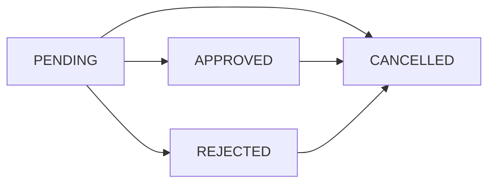

# Colección: Aprobaciones

## Descripción General
La colección `approvals` gestiona las solicitudes de aprobación para pruebas complementarias en casos médicos, permitiendo un flujo de trabajo controlado para estudios adicionales que requieren autorización previa.

## Esquema de Datos

### Campos Principales

| Campo | Tipo | Requerido | Descripción |
|-------|------|-----------|-------------|
| `_id` | ObjectId | Sí | Identificador único del documento |
| `approval_code` | String | Sí | Código único de la solicitud (A-YYYY-NNNN) |
| `original_case_code` | String | Sí | Código del caso original |
| `approval_state` | Enum | Sí | Estado actual de la aprobación |
| `complementary_tests` | Array | Sí | Lista de pruebas complementarias solicitadas |
| `approval_info` | Object | Sí | Información del proceso de aprobación |
| `created_at` | DateTime | Sí | Fecha de creación |
| `updated_at` | DateTime | Sí | Fecha de última actualización |

## Enumeraciones

### ApprovalStateEnum
```python
class ApprovalStateEnum(str, Enum):
    PENDING = "pending"        # Pendiente de revisión
    APPROVED = "approved"      # Aprobada
    REJECTED = "rejected"      # Rechazada
    CANCELLED = "cancelled"    # Cancelada
```

## Estructura de Subdocumentos

### ComplementaryTestInfo
```json
{
  "test_id": "string",
  "test_name": "string", 
  "test_code": "string",
  "justification": "string",
  "estimated_cost": "number",
  "priority": "string"
}
```

### ApprovalInfo
```json
{
  "requested_by": "string",
  "request_date": "datetime",
  "reason": "string",
  "reviewed_by": "string",
  "review_date": "datetime",
  "review_comments": "string",
  "approval_date": "datetime"
}
```

## Validaciones

- **approval_code**: Único en el sistema, formato A-YYYY-NNNN
- **original_case_code**: Debe corresponder a un caso existente
- **approval_state**: Debe ser uno de los valores del enum
- **complementary_tests**: Array no vacío con al menos una prueba
- **reason**: Justificación requerida, máximo 1000 caracteres
- **approval_info**: Información completa del proceso

## Índices Recomendados

```javascript
// Índice único para código de aprobación
db.approvals.createIndex({ "approval_code": 1 }, { unique: true })

// Índice para búsquedas por caso original
db.approvals.createIndex({ "original_case_code": 1 })

// Índice para filtros por estado
db.approvals.createIndex({ "approval_state": 1 })

// Índice para búsquedas por solicitante
db.approvals.createIndex({ "approval_info.requested_by": 1 })

// Índice para búsquedas por revisor
db.approvals.createIndex({ "approval_info.reviewed_by": 1 })

// Índice compuesto para reportes
db.approvals.createIndex({ 
  "approval_state": 1, 
  "created_at": -1 
})

// Índice para fechas de solicitud
db.approvals.createIndex({ "approval_info.request_date": -1 })
```

## Esquemas de Operación

### ApprovalRequestCreate
```python
class ApprovalRequestCreate(BaseModel):
    original_case_code: str = Field(..., description="Original case code")
    complementary_tests: List[ComplementaryTestInfo] = Field(..., description="Requested tests")
    reason: str = Field(..., max_length=1000, description="Request reason")
```

### ApprovalRequestUpdate
```python
class ApprovalRequestUpdate(BaseModel):
    approval_state: Optional[ApprovalStateEnum] = None
    complementary_tests: Optional[List[ComplementaryTestInfo]] = None
```

### ApprovalRequestResponse
```python
class ApprovalRequestResponse(BaseModel):
    id: str = Field(..., description="Unique request ID")
    approval_code: str = Field(..., description="Unique approval code")
    original_case_code: str = Field(..., description="Original case code")
    approval_state: ApprovalStateEnum = Field(..., description="Approval state")
    complementary_tests: List[ComplementaryTestInfo] = Field(..., description="Tests")
    approval_info: ApprovalInfo = Field(..., description="Process information")
    created_at: datetime = Field(..., description="Creation date")
    updated_at: datetime = Field(..., description="Update date")
```

## Flujo de Estados



## Generación de Códigos

El código de aprobación sigue el patrón:
- **A**: Prefijo para aprobaciones
- **YYYY**: Año de creación
- **NNNN**: Número secuencial (4 dígitos)

Ejemplo: `A-2024-0001`, `A-2024-0002`, etc.

## Casos de Uso Principales

1. **Solicitud de Pruebas**: Creación de solicitudes para estudios adicionales
2. **Revisión de Solicitudes**: Evaluación y aprobación/rechazo por autoridades
3. **Seguimiento de Estados**: Monitoreo del progreso de solicitudes
4. **Gestión de Costos**: Control de gastos en pruebas complementarias
5. **Auditoría de Procesos**: Registro de decisiones y justificaciones
6. **Reportes de Aprobaciones**: Análisis de patrones de solicitudes

## Proceso de Aprobación

### 1. Creación de Solicitud
```python
def create_approval_request(case_code: str, tests: List[dict], reason: str, user_id: str):
    approval_code = generate_approval_code()
    
    request = {
        "approval_code": approval_code,
        "original_case_code": case_code,
        "approval_state": ApprovalStateEnum.PENDING,
        "complementary_tests": tests,
        "approval_info": {
            "requested_by": user_id,
            "request_date": datetime.utcnow(),
            "reason": reason
        }
    }
    
    return db.approvals.insert_one(request)
```

### 2. Revisión de Solicitud
```python
def review_approval_request(approval_id: str, state: ApprovalStateEnum, 
                          reviewer_id: str, comments: str):
    update_data = {
        "approval_state": state,
        "approval_info.reviewed_by": reviewer_id,
        "approval_info.review_date": datetime.utcnow(),
        "approval_info.review_comments": comments,
        "updated_at": datetime.utcnow()
    }
    
    if state == ApprovalStateEnum.APPROVED:
        update_data["approval_info.approval_date"] = datetime.utcnow()
    
    return db.approvals.update_one(
        {"_id": ObjectId(approval_id)},
        {"$set": update_data}
    )
```

## Métricas y Estadísticas

### ApprovalStats
```python
class ApprovalStats(BaseModel):
    total_requests: int = 0
    requests_made: int = 0
    pending_approval: int = 0
    approved: int = 0
    rejected: int = 0
```

### Cálculo de Métricas
```python
def calculate_approval_stats(date_from: datetime, date_to: datetime):
    pipeline = [
        {
            "$match": {
                "created_at": {"$gte": date_from, "$lte": date_to}
            }
        },
        {
            "$group": {
                "_id": "$approval_state",
                "count": {"$sum": 1}
            }
        }
    ]
    
    results = db.approvals.aggregate(pipeline)
    return process_stats_results(results)
```

## Notificaciones

### Eventos de Notificación
- **Nueva Solicitud**: Notificar a revisores
- **Aprobación**: Notificar al solicitante y equipo del caso
- **Rechazo**: Notificar al solicitante con razones
- **Vencimiento**: Alertar sobre solicitudes pendientes

### Implementación
```python
async def send_approval_notification(approval_id: str, event_type: str):
    approval = await get_approval_by_id(approval_id)
    
    if event_type == "new_request":
        await notify_reviewers(approval)
    elif event_type == "approved":
        await notify_requester(approval, "approved")
    elif event_type == "rejected":
        await notify_requester(approval, "rejected")
```

## Relaciones

- **Casos**: Cada solicitud está vinculada a un caso específico
- **Pruebas**: Las solicitudes referencian pruebas del catálogo
- **Usuarios**: Solicitantes y revisores son usuarios del sistema
- **Contadores**: Utiliza `approval_counters` para numeración secuencial

## Consideraciones de Rendimiento

- Implementar índices para consultas frecuentes por estado y fecha
- Cache para solicitudes activas frecuentemente consultadas
- Optimizar consultas de búsqueda por caso y usuario
- Considerar archivado de solicitudes antiguas completadas
- Monitorear el crecimiento de la colección

## Consideraciones de Seguridad

- Validar permisos antes de crear o modificar solicitudes
- Auditar todos los cambios de estado críticos
- Controlar acceso a solicitudes por rol y entidad
- Implementar validación de integridad de datos
- Mantener logs detallados de decisiones de aprobación

## Integración con Workflow

### Estados de Transición
```python
VALID_TRANSITIONS = {
    ApprovalStateEnum.PENDING: [
        ApprovalStateEnum.APPROVED,
        ApprovalStateEnum.REJECTED,
        ApprovalStateEnum.CANCELLED
    ],
    ApprovalStateEnum.APPROVED: [
        ApprovalStateEnum.CANCELLED
    ],
    ApprovalStateEnum.REJECTED: [
        ApprovalStateEnum.CANCELLED
    ]
}

def validate_state_transition(current_state: str, new_state: str) -> bool:
    return new_state in VALID_TRANSITIONS.get(current_state, [])
```