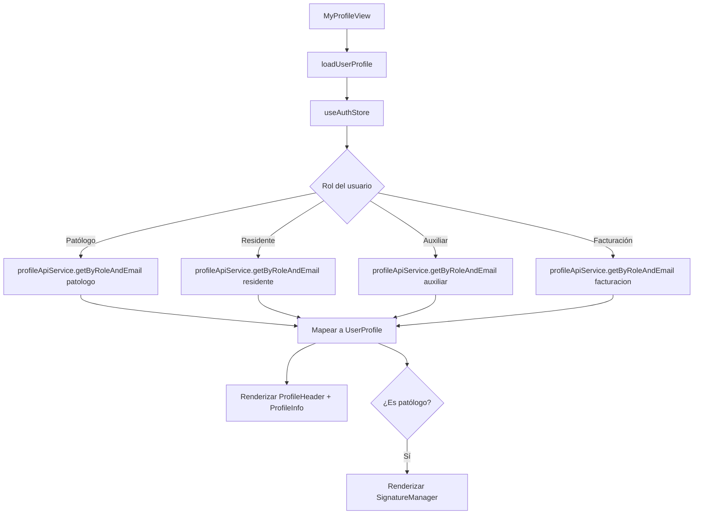
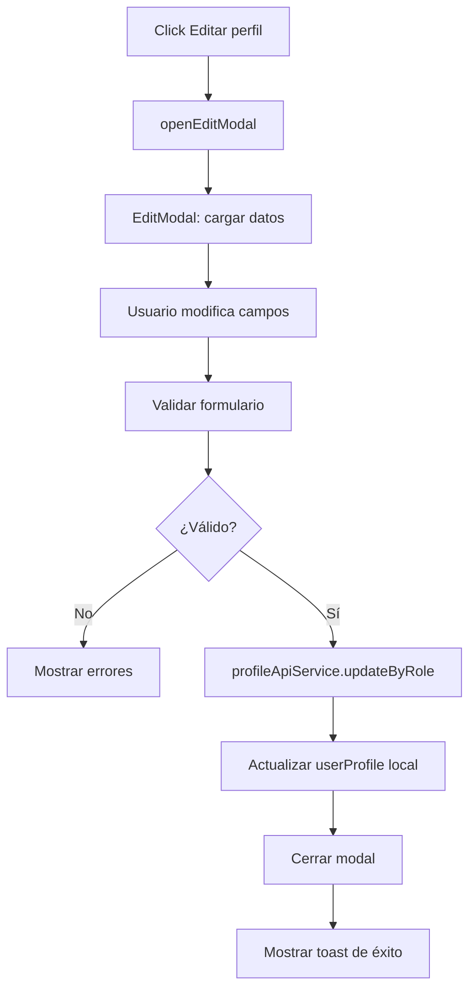
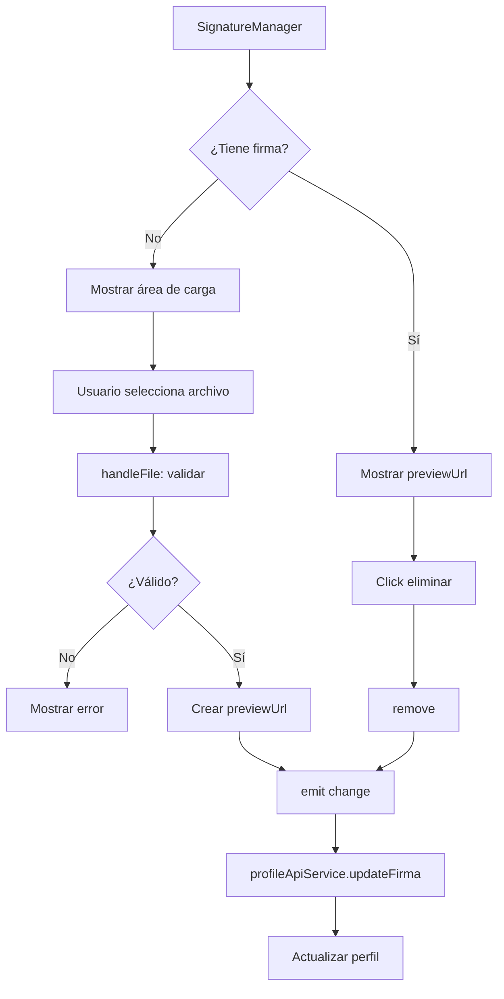
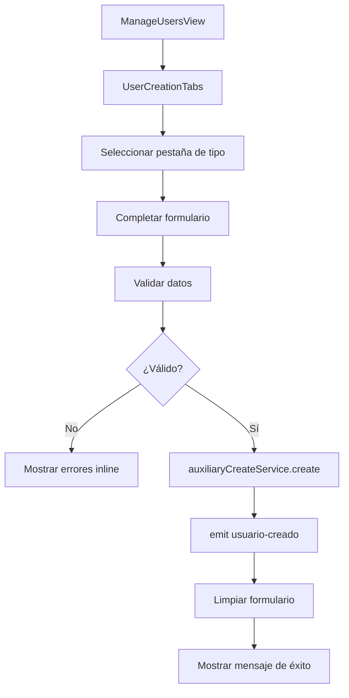
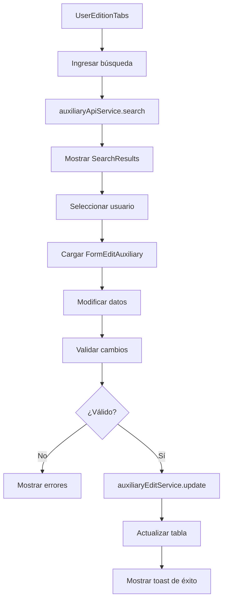

import CodeBlock from '@theme/CodeBlock';

## ¿Qué es el módulo Profile?

El **módulo de Perfiles** permite gestionar la información de usuarios del sistema, tanto del perfil propio como la administración de cuentas. Incluye visualización y edición de datos personales, gestión de firma digital para patólogos, y herramientas de creación y edición de usuarios por tipo (auxiliares, patólogos, residentes, facturación, entidades y pruebas).

## Arquitectura

```
modules/profile/
├── components/
│   ├── MyProfile/
│   │   ├── ProfileHeader.vue       ← Encabezado con avatar y botón editar
│   │   ├── ProfileInfo.vue         ← Información personal y por rol
│   │   ├── EditModal.vue           ← Modal de edición de perfil
│   │   ├── SignatureManager.vue    ← Gestor de firma digital (patólogos)
│   │   └── ProfileEditForm.vue     ← Formulario de edición
│   ├── SeccionCreacion/
│   │   ├── UserCreationTabs.vue    ← Pestañas de creación
│   │   ├── FormAuxiliary.vue       ← Formulario auxiliar administrativo
│   │   ├── FormPathologist.vue     ← Formulario patólogo
│   │   ├── FormResident.vue        ← Formulario residente
│   │   ├── FormBilling.vue         ← Formulario facturación
│   │   ├── FormEntity.vue          ← Formulario entidad
│   │   └── FormTests.vue           ← Formulario pruebas
│   └── SeccionEdicion/
│       ├── UserEditionTabs.vue     ← Pestañas de edición
│       ├── UserSearch.vue          ← Buscador de usuarios
│       ├── SearchResults.vue       ← Tabla de resultados
│       ├── FormEditAuxiliary.vue   ← Edición auxiliar
│       ├── FormEditPathologist.vue ← Edición patólogo
│       ├── FormEditResident.vue    ← Edición residente
│       └── FormEditBilling.vue     ← Edición facturación
├── composables/
│   ├── useProfileEdit.ts           ← Lógica de edición de perfil
│   ├── useSignatureManager.ts      ← Gestión de firma digital
│   ├── useRoleMapping.ts           ← Mapeo de roles del sistema
│   ├── useAuxiliaryCreation.ts     ← Creación de auxiliares
│   ├── usePathologistCreation.ts   ← Creación de patólogos
│   ├── useResidentCreation.ts      ← Creación de residentes
│   ├── useBillingCreation.ts       ← Creación de facturación
│   ├── useEntityCreation.ts        ← Creación de entidades
│   └── useTestCreation.ts          ← Creación de pruebas
├── services/
│   ├── profileApiService.ts        ← API de perfiles
│   ├── auxiliaryApiService.ts      ← API de auxiliares
│   ├── pathologistApiService.ts    ← API de patólogos
│   ├── residentApiService.ts       ← API de residentes
│   ├── billingApiService.ts        ← API de facturación
│   ├── entitySearchService.ts      ← Búsqueda de entidades
│   └── testSearchService.ts        ← Búsqueda de pruebas
├── types/
│   ├── userProfile.types.ts        ← Tipos de perfil de usuario
│   ├── auxiliary.types.ts          ← Tipos de auxiliar
│   ├── pathologist.types.ts        ← Tipos de patólogo
│   ├── resident.types.ts           ← Tipos de residente
│   ├── billing.types.ts            ← Tipos de facturación
│   ├── entity.types.ts             ← Tipos de entidad
│   └── test.types.ts               ← Tipos de prueba
├── views/
│   ├── MyProfileView.vue           ← Vista de mi perfil
│   └── ManageUsersView.vue         ← Vista de gestión de usuarios
├── routes/
│   └── profileRoutes.ts            ← Rutas del módulo
└── styles/
    └── profile.css                 ← Estilos específicos
```

## Mi Perfil (MyProfileView)

### Vista de perfil
Muestra la información del usuario autenticado con datos personales, información específica del rol y firma digital (solo patólogos).


<div style={{fontSize: '14px', color: '#6b7280', fontStyle: 'italic', marginBottom: '16px'}}>
  Vista del perfil con información personal, datos específicos del rol y sección de firma digital.
</div>

### ProfileHeader.vue
Encabezado con avatar del usuario, nombre, email, rol y botón de edición.

**Características:**
- Avatar por defecto según el rol (estetoscopio para patólogos)
- Indicador de estado en línea
- Badge del rol del usuario

### ProfileInfo.vue
Tarjetas de información personal y datos específicos por rol.


<div style={{fontSize: '14px', color: '#6b7280', fontStyle: 'italic', marginBottom: '16px'}}>
  Tarjetas con información personal (nombre, email, rol, estado) e información específica según el tipo de usuario.
</div>

**Datos mostrados:**
- Información Personal: Nombre completo, correo electrónico, rol, estado
- Información Específica del Rol:
  - Patólogos/Residentes: Iniciales, Registro Médico
  - Todos los roles: Observaciones adicionales

### SignatureManager.vue
Gestor de firma digital exclusivo para patólogos.


<div style={{fontSize: '14px', color: '#6b7280', fontStyle: 'italic', marginBottom: '16px'}}>
  Componente de carga de firma digital con drag & drop, vista previa y validación de formato.
</div>

**Características:**
- Carga por drag & drop o selector de archivos
- Validación de formato (PNG, JPG, SVG)
- Límite de tamaño: 1MB
- Vista previa en tiempo real
- Eliminación de firma existente
- Uso automático en reportes médicos

**Lógica del composable (useSignatureManager):**
<CodeBlock language="typescript">{`const handleFile = async (file: File) => {
  if (!isPatologo.value) return
  
  // Validar tamaño
  if (file.size > 1024 * 1024) {
    throw new Error('El archivo debe ser menor a 1MB')
  }
  
  // Validar formato
  const validTypes = ['image/png', 'image/jpeg', 'image/svg+xml']
  if (!validTypes.includes(file.type)) {
    throw new Error('Solo se permiten archivos PNG, JPG o SVG')
  }
  
  selectedFile.value = file
  previewUrl.value = URL.createObjectURL(file)
  isUploading.value = true
}`}</CodeBlock>

### EditModal.vue
Modal para editar la información del perfil con validación dinámica según el rol.

**Campos editables por rol:**
<CodeBlock language="typescript">{`// Patólogo
{
  patologoName: string
  InicialesPatologo?: string
  PatologoEmail: string
  registro_medico: string
  password?: string
  observaciones?: string
}

// Residente
{
  residenteName: string
  InicialesResidente?: string
  ResidenteEmail: string
  registro_medico: string
  password?: string
  observaciones?: string
}

// Auxiliar/Facturación
{
  auxiliarName: string
  AuxiliarEmail: string
  password?: string
  observaciones?: string
}`}</CodeBlock>

## Gestión de Usuarios (ManageUsersView)

Vista administrativa para crear y editar usuarios del sistema. Organizada en dos columnas: creación (izquierda) y edición (derecha).

### Creación de Usuarios (UserCreationTabs)


<div style={{fontSize: '14px', color: '#6b7280', fontStyle: 'italic', marginBottom: '16px'}}>
  Sistema de pestañas para crear diferentes tipos de usuarios con validación en tiempo real.
</div>

**Tipos de usuarios creables:**
1. **Auxiliar Administrativo**: Nombre, código, email, contraseña, observaciones
2. **Facturación**: Nombre, código, email, contraseña, observaciones
3. **Patólogo**: Nombre, iniciales, email, registro médico, contraseña, observaciones
4. **Residente**: Nombre, iniciales, email, registro médico, contraseña, observaciones
5. **Entidad**: Gestión de entidades médicas
6. **Pruebas**: Configuración de tipos de pruebas

**Ejemplo de creación (FormAuxiliary):**
<CodeBlock language="typescript">{`const createAuxiliary = async () => {
  const payload = {
    auxiliarName: form.fullName,
    auxiliarCode: form.code,
    AuxiliarEmail: form.email,
    password: form.password,
    activo: form.isActive,
    observaciones: form.observations
  }
  
  await auxiliaryCreateService.create(payload)
  emit('usuario-creado', { tipo: 'auxiliar', data: payload })
  resetForm()
}`}</CodeBlock>

### Edición de Usuarios (UserEditionTabs)


<div style={{fontSize: '14px', color: '#6b7280', fontStyle: 'italic', marginBottom: '16px'}}>
  Búsqueda de usuarios con filtros por tipo, tabla de resultados y formulario de edición con datos pre-cargados.
</div>

**Funcionalidades:**
- Búsqueda por código o nombre de usuario
- Filtrado por tipo de usuario (pestañas)
- Tabla de resultados con información resumida
- Formulario de edición con datos pre-cargados
- Actualización de contraseña (opcional)
- Cambio de estado (Activo/Inactivo)

**Flujo de edición:**
<CodeBlock language="typescript">{`// 1. Búsqueda
const searchResults = await auxiliaryApiService.search(query)

// 2. Selección
const selectedUser = searchResults.find(u => u.code === selectedCode)

// 3. Edición
const updatePayload = {
  auxiliarName: form.fullName,
  AuxiliarEmail: form.email,
  password: form.newPassword || undefined,
  observaciones: form.observations
}

await auxiliaryEditService.update(selectedCode, updatePayload)

// 4. Actualización de tabla
searchResults.value = searchResults.value.map(u => 
  u.code === selectedCode ? { ...u, ...updatePayload } : u
)`}</CodeBlock>

## Servicios y Endpoints

### profileApiService.ts
Servicio principal para gestión de perfiles con endpoints por rol.

**Obtener perfil por email y rol:**
<CodeBlock language="typescript">{`async getByRoleAndEmail(role: UserRole, email: string): Promise<any> {
  const endpoints = {
    'patologo': \`/pathologists/by-email/\${email}\`,
    'residente': \`/residents/by-email/\${email}\`,
    'auxiliar': \`/auxiliaries/by-email/\${email}\`,
    'facturacion': \`/billing/by-email/\${email}\`
  }
  
  const response = await apiClient.get(endpoints[role])
  return response.data
}`}</CodeBlock>

**Actualizar perfil:**
<CodeBlock language="typescript">{`async updateByRole(role: UserRole, code: string, data: any): Promise<void> {
  const endpoints = {
    'patologo': \`/pathologists/\${code}\`,
    'residente': \`/residents/\${code}\`,
    'auxiliar': \`/auxiliaries/\${code}\`,
    'facturacion': \`/billing/\${code}\`
  }
  
  await apiClient.put(endpoints[role], data)
}`}</CodeBlock>

**Actualizar firma digital:**
<CodeBlock language="typescript">{`async updateFirma(pathologistCode: string, firmaUrl: string): Promise<void> {
  await apiClient.patch(\`/pathologists/\${pathologistCode}/signature\`, {
    firma: firmaUrl
  })
}`}</CodeBlock>

### Servicios de creación y edición
Cada tipo de usuario tiene servicios especializados para creación y edición.

**Ejemplo: auxiliaryCreateService.ts**
<CodeBlock language="typescript">{`class AuxiliaryCreateService {
  async create(data: AuxiliaryCreatePayload): Promise<AuxiliaryResponse> {
    const response = await apiClient.post('/auxiliaries/', {
      auxiliarName: data.auxiliarName,
      auxiliarCode: data.auxiliarCode,
      AuxiliarEmail: data.AuxiliarEmail,
      password: data.password,
      activo: data.activo ?? true,
      observaciones: data.observaciones || ''
    })
    return response.data
  }
}

export const auxiliaryCreateService = new AuxiliaryCreateService()`}</CodeBlock>

## Tipos e Interfaces

### UserProfile
<CodeBlock language="typescript">{`export type UserRole = 'admin' | 'patologo' | 'residente' | 'auxiliar' | 'facturacion'

export interface UserProfile {
  id: string
  firstName: string
  lastName: string
  email: string
  phone?: string
  document: string
  documentType: 'CC' | 'CE' | 'PP'
  role: UserRole
  avatar?: string
  isActive: boolean
  lastLogin?: Date
  createdAt: Date
  updatedAt: Date
  roleSpecificData?: RoleSpecificData
}

export interface RoleSpecificData {
  iniciales?: string
  registroMedico?: string
  firmaUrl?: string
  observaciones?: string
}`}</CodeBlock>

### ProfileEditPayload (discriminated union)
<CodeBlock language="typescript">{`export type ProfileEditPayload =
  | {
      role: 'patologo'
      patologoName: string
      InicialesPatologo?: string
      PatologoEmail: string
      registro_medico: string
      password?: string
      passwordConfirm?: string
      observaciones?: string
    }
  | {
      role: 'residente'
      residenteName: string
      InicialesResidente?: string
      ResidenteEmail: string
      registro_medico: string
      password?: string
      passwordConfirm?: string
      observaciones?: string
    }
  | {
      role: 'auxiliar'
      auxiliarName: string
      auxiliarCode: string
      AuxiliarEmail: string
      password?: string
      passwordConfirm?: string
      observaciones?: string
    }
  | {
      role: 'facturacion'
      facturacionName: string
      facturacionCode: string
      FacturacionEmail: string
      password?: string
      passwordConfirm?: string
      observaciones?: string
    }`}</CodeBlock>

## Rutas

<CodeBlock language="typescript">{`export const profileRoutes: RouteRecordRaw[] = [
  {
    path: '/profile',
    name: 'profile',
    redirect: '/profile/my-profile',
    children: [
      {
        path: 'my-profile',
        name: 'profile-my-profile',
        component: () => import('../views/MyProfileView.vue'),
        meta: {
          title: 'Mi Perfil',
          requiresAuth: true
        }
      },
      {
        path: 'users',
        name: 'profile-users',
        component: () => import('../views/ManageUsersView.vue'),
        meta: {
          title: 'Gestión de Usuarios',
          requiresAuth: true,
          requiredRole: 'admin'
        }
      }
    ]
  }
]`}</CodeBlock>

## Flujo de datos

### Carga de perfil propio


### Edición de perfil


### Gestión de firma digital


### Creación de usuario


### Edición de usuario


## Control de Acceso

### Permisos por rol
- **Mi Perfil**: Todos los roles pueden ver y editar su propio perfil
- **Firma Digital**: Solo patólogos pueden gestionar su firma
- **Gestión de Usuarios**: Solo administradores tienen acceso completo

### Validaciones de seguridad
- Verificación de autenticación antes de cargar datos
- Validación de permisos al editar
- Sanitización de datos de entrada
- Confirmación de cambio de contraseña
- Validación de formato de correo electrónico

## Buenas prácticas implementadas

- **Mapeo dinámico de roles**: Conversión flexible entre nomenclaturas del backend
- **Validación por tipo**: Union types de TypeScript para payloads específicos por rol
- **Actualización optimista**: UI se actualiza inmediatamente tras cambios
- **Gestión de errores**: Captura y muestra de errores específicos del backend
- **Separación de responsabilidades**: Composables, servicios y componentes bien delimitados
- **Reutilización**: Componentes compartidos (`FormInput`, `FormSelect`, etc.)