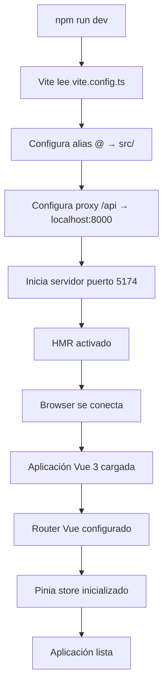

import CodeBlock from '@theme/CodeBlock';

## ¿Qué es la configuración del proyecto?

La **configuración del proyecto** en PathSys define cómo se estructura, arranca y ejecuta el Front-End. Incluye la configuración de Vite como bundler principal, TypeScript para tipado estático, el setup de desarrollo, y todas las herramientas necesarias para que la aplicación funcione correctamente.

### ¿Por qué es importante?

- **Arranque del proyecto**: Define cómo se inicia el servidor de desarrollo
- **Estructura de archivos**: Establece cómo se organizan y resuelven los módulos
- **Entorno de desarrollo**: Configura el servidor, proxy y herramientas de desarrollo
- **Build y despliegue**: Define cómo se compila la aplicación para producción

## Arquitectura de configuración

PathSys utiliza una configuración moderna basada en herramientas estándar de la industria:

```
┌─────────────────────────────────────────────────────────────┐
│                    STACK PRINCIPAL                          │
├─────────────────────────────────────────────────────────────┤
│  • Vite 7.1.7          ← Bundler y servidor de desarrollo   │
│  • Vue 3.5.22          ← Framework principal                │
│  • TypeScript 5.9.2    ← Tipado estático                    │
│  • Node.js             ← Runtime de desarrollo              │
├─────────────────────────────────────────────────────────────┤
│                    HERRAMIENTAS DE DESARROLLO               │
├─────────────────────────────────────────────────────────────┤
│  • Vue Router 4.5.1    ← Enrutamiento                       │
│  • Pinia 3.0.3         ← Gestión de estado                  │
│  • Axios 1.12.2        ← Cliente HTTP                       │
│  • Tailwind CSS 3.4.17 ← Framework CSS                      │
├─────────────────────────────────────────────────────────────┤
│                    HERRAMIENTAS DE BUILD                    │
├─────────────────────────────────────────────────────────────┤
│  • PostCSS 8.5.6       ← Procesador de CSS                  │
│  • Autoprefixer        ← Compatibilidad de navegadores      │
│  • vue-tsc             ← TypeScript para Vue                │
└─────────────────────────────────────────────────────────────┘
```

## Configuración de Vite

Vite es el bundler principal de PathSys, configurado para desarrollo rápido y builds optimizados.

### Archivo de configuración principal

<CodeBlock language="typescript">{`// vite.config.ts
import { defineConfig } from 'vite'
import vue from '@vitejs/plugin-vue'
import { resolve } from 'path'

export default defineConfig({
  plugins: [vue()],
  resolve: {
    alias: {
      '@': resolve(__dirname, 'src'),
    },
  },
  server: {
    port: 5174,
    host: true,
    proxy: {
      '/api': {
        target: 'http://localhost:8000',
        changeOrigin: true,
        secure: false,
      }
    }
  }
})`}</CodeBlock>

### Características de la configuración

**Plugins:**
- **@vitejs/plugin-vue**: Soporte completo para componentes Vue 3
- **Vue SFC**: Procesamiento automático de archivos `.vue`

**Alias de rutas:**
- **`@/`** → **`src/`**: Permite importaciones absolutas desde la raíz del src
- **Ejemplo**: `import Component from '@/components/Component.vue'`

**Servidor de desarrollo:**
- **Puerto**: 5174 (configurado para evitar conflictos)
- **Host**: `true` (accesible desde la red local)
- **Proxy API**: Redirige `/api/*` a `http://localhost:8000` (Back-End)

**Beneficios del proxy:**
- **CORS**: Evita problemas de CORS en desarrollo
- **Desarrollo local**: Back-End y Front-End en puertos diferentes
- **Transparente**: Las peticiones se ven como si fueran al mismo dominio

## Configuración de TypeScript

TypeScript proporciona tipado estático y mejor experiencia de desarrollo.

### Archivo de configuración

<CodeBlock language="json">{`// tsconfig.json
{
  "compilerOptions": {
    "target": "ES2020",
    "useDefineForClassFields": true,
    "lib": ["ES2020", "DOM", "DOM.Iterable"],
    "module": "ESNext",
    "skipLibCheck": true,
    "moduleResolution": "bundler",
    "allowImportingTsExtensions": true,
    "resolveJsonModule": true,
    "isolatedModules": true,
    "noEmit": true,
    "jsx": "preserve",
    "strict": true,
    "noUnusedLocals": true,
    "noUnusedParameters": true,
    "noFallthroughCasesInSwitch": true,
    "ignoreDeprecations": "6.0",
    "baseUrl": ".",
    "paths": {
      "@/*": ["src/*"]
    }
  },
  "include": ["src/**/*.ts", "src/**/*.d.ts", "src/**/*.tsx", "src/**/*.vue"],
  "references": [{ "path": "./tsconfig.node.json" }]
}`}</CodeBlock>

### Características de la configuración

**Target y libs:**
- **ES2020**: Funciones modernas de JavaScript
- **DOM**: APIs del navegador
- **DOM.Iterable**: Iteradores para elementos DOM

**Configuración estricta:**
- **strict**: Habilita todas las verificaciones estrictas
- **noUnusedLocals**: Error si hay variables no usadas
- **noUnusedParameters**: Error si hay parámetros no usados

**Resolución de módulos:**
- **moduleResolution**: "bundler" para Vite
- **allowImportingTsExtensions**: Permite importar archivos `.ts`
- **paths**: Alias `@/*` para importaciones absolutas

## Configuración de Tailwind CSS

Tailwind CSS está configurado para procesar estilos en todos los archivos Vue, TypeScript y JavaScript del proyecto.

### Configuración básica

<CodeBlock language="javascript">{`// tailwind.config.js
export default {
  content: [
    "./index.html",
    "./src/**/*.{vue,js,ts,jsx,tsx}",
  ],
  theme: {
    extend: {
      colors: {
        // Colores LIME del sistema hospitalario
        'LIME-Azul-Claro': '#CAEAF2',
        'LIME-Azul-2': '#8FC8DE',
        'LIME-Azul-3': '#5CA6C9',
        'LIME-Azul-4': '#2974A3',
        'LIME-Azul-Oscuro': '#064D5F',
        
        // Colores de marca y estado
        brand: { /* escala de verdes */ },
        success: { /* escala de verdes */ },
        error: { /* escala de rojos */ },
        warning: { /* escala de amarillos */ }
      },
      
      fontFamily: {
        sans: ['Outfit', 'ui-sans-serif', 'system-ui'],
      },
      
      // Espaciado y tamaños personalizados
      spacing: { /* valores adicionales */ },
      fontSize: { /* tamaños personalizados */ },
      boxShadow: { /* sombras personalizadas */ }
    },
  },
  plugins: [],
}`}</CodeBlock>

### Características principales

**Procesamiento de archivos:**
- **Content**: Busca clases Tailwind en todos los archivos del proyecto
- **Vue SFC**: Procesa automáticamente archivos `.vue`
- **TypeScript**: Compatible con archivos `.ts` y `.tsx`

**Colores personalizados:**
- **LIME**: Paleta de colores institucionales
- **Brand**: Colores de marca del sistema
- **Estados**: Success, error, warning para feedback

**Tipografía:**
- **Outfit**: Fuente principal importada desde Google Fonts
- **Fallbacks**: Sistema de fuentes de respaldo

## Configuración de PostCSS

PostCSS procesa los estilos CSS y aplica transformaciones automáticas.

### Configuración básica

<CodeBlock language="javascript">{`// postcss.config.js
export default {
  plugins: {
    tailwindcss: {},    // Procesa directivas de Tailwind
    autoprefixer: {},   // Agrega prefijos de navegador
  },
}`}</CodeBlock>

**Procesamiento automático:**
- **Tailwind**: Convierte clases de utilidad en CSS
- **Autoprefixer**: Agrega prefijos para compatibilidad de navegadores

## Sistema de estilos CSS

### Estructura de archivos

```
src/assets/styles/
├── main.css           ← Punto de entrada principal
├── base/              ← Variables y estilos base
│   ├── variables.css  ← Variables CSS del sistema LIME
│   ├── reset.css      ← Resets y normalización
│   └── globals.css    ← Estilos globales
├── components/        ← Estilos de componentes específicos
└── vendor/            ← Estilos de librerías externas
```

### Archivo principal

<CodeBlock language="css">{`/* src/assets/styles/main.css */

/* Tailwind CSS */
@import 'tailwindcss/base';
@import 'tailwindcss/components';
@import 'tailwindcss/utilities';

/* Fuente principal */
@import url('https://fonts.googleapis.com/css2?family=Outfit:wght@100..900&display=swap');

/* Estilos del sistema */
@import './base/variables.css';
@import './base/reset.css';
@import './base/globals.css';

/* Componentes */
@import './components/utilities.css';
@import './components/navigation.css';
@import './components/buttons.css';
@import './components/forms.css';

/* Librerías externas */
@import './vendor/apexcharts.css';
@import './vendor/flatpickr.css';`}</CodeBlock>

## Dependencias del proyecto

### Dependencias principales

<CodeBlock language="json">{`{
  "dependencies": {
    "@heroicons/vue": "^2.2.0",    // Iconos SVG
    "apexcharts": "^5.3.5",        // Gráficos y visualizaciones
    "axios": "^1.12.2",            // Cliente HTTP
    "pdfjs-dist": "^5.4.149",      // Generación de PDFs
    "pinia": "^3.0.3",             // Gestión de estado
    "vue": "^3.5.22",              // Framework principal
    "vue-router": "^4.5.1",        // Enrutamiento
    "vue3-apexcharts": "^1.8.0",   // Wrapper de ApexCharts para Vue
    "xlsx": "^0.18.5"              // Manejo de archivos Excel
  }
}`}</CodeBlock>

### Dependencias de desarrollo

<CodeBlock language="json">{`{
  "devDependencies": {
    "@types/node": "^24.5.2",           // Tipos de Node.js
    "@vitejs/plugin-vue": "^6.0.1",     // Plugin Vue para Vite
    "autoprefixer": "^10.4.21",         // Prefijos CSS automáticos
    "postcss": "^8.5.6",                // Procesador CSS
    "tailwindcss": "^3.4.17",           // Framework CSS
    "typescript": "^5.9.2",             // Compilador TypeScript
    "vite": "^7.1.7",                   // Bundler y servidor
    "vue-tsc": "^3.0.8"                 // TypeScript para Vue
  }
}`}</CodeBlock>

## Cómo arranca el proyecto

### Scripts de desarrollo

<CodeBlock language="json">{`{
  "scripts": {
    "dev": "vite --port 5174",          // Servidor de desarrollo
    "build": "vite build",              // Build de producción
    "preview": "vite preview",          // Preview del build
    "type-check": "vue-tsc --noEmit"    // Verificación de tipos
  }
}`}</CodeBlock>

### Proceso de arranque

**1. Inicialización del servidor:**
```bash
npm run dev
```

**2. Vite inicia el servidor de desarrollo:**
- **Puerto**: 5174 (configurado en vite.config.ts)
- **Host**: true (accesible desde la red local)
- **HMR**: Hot Module Replacement activado

**3. Proxy automático:**
- **`/api/*`** → **`http://localhost:8000`** (Back-End)
- **CORS**: Resuelto automáticamente
- **Transparente**: Las peticiones se ven como mismo dominio

**4. Resolución de módulos:**
- **Alias `@/`** → **`src/`** para importaciones absolutas
- **TypeScript**: Verificación de tipos en tiempo real
- **Vue SFC**: Procesamiento automático de archivos `.vue`

### Flujo de arranque completo



### Comandos de uso

**Desarrollo:**
```bash
npm run dev          # Inicia servidor en puerto 5174
npm run type-check   # Verifica tipos TypeScript
```

**Producción:**
```bash
npm run build        # Genera build optimizado
npm run preview      # Previsualiza el build
```

## Variables de entorno

### Configuración de entorno

```bash
# .env
VITE_API_BASE_URL=http://localhost:8000
VITE_APP_ENV=development
```

**Variables disponibles:**
- **VITE_API_BASE_URL**: URL base del Back-End
- **VITE_APP_ENV**: Entorno de la aplicación
- **Import.meta.env**: Acceso a variables en el código

**Uso en código:**
<CodeBlock language="typescript">{`// Acceso a variables de entorno
const apiUrl = import.meta.env.VITE_API_BASE_URL
const isDev = import.meta.env.DEV
const isProd = import.meta.env.PROD`}</CodeBlock>

## Mejores prácticas implementadas

### 1. **Configuración moderna**
- **Vite**: Bundler rápido con HMR (Hot Module Replacement)
- **TypeScript**: Tipado estático para mejor DX
- **Tailwind**: Utility-first CSS para desarrollo rápido

### 2. **Alias de rutas**
- **`@/`**: Importaciones absolutas desde `src/`
- **Consistencia**: Misma configuración en Vite y TypeScript

### 3. **Proxy de desarrollo**
- **CORS**: Solución automática para desarrollo local
- **Transparente**: API calls sin configuración adicional

### 4. **Sistema de diseño**
- **Colores LIME**: Paleta institucional personalizada
- **Tipografía**: Fuente Outfit con escalas definidas
- **Espaciado**: Sistema de espaciado consistente

### 5. **Optimización**
- **Tree shaking**: Eliminación de código no usado
- **Code splitting**: División automática de chunks
- **Minificación**: Compresión automática en producción

Esta configuración asegura que PathSys tenga un entorno de desarrollo robusto, eficiente y mantenible, con todas las herramientas necesarias para el desarrollo moderno de aplicaciones Vue 3.
