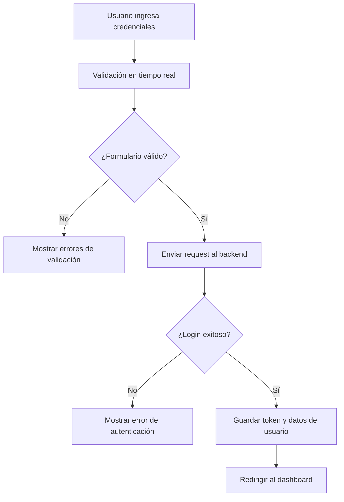

import CodeBlock from '@theme/CodeBlock';

## ¿Qué es el módulo Auth?

El **módulo Auth** es el sistema de autenticación y autorización de PathSys, responsable de gestionar el acceso de usuarios al sistema. Proporciona funcionalidades de login, logout, validación de credenciales, persistencia de sesión y verificación de tokens JWT.

### ¿Por qué es importante?

- **Seguridad**: Protege el acceso al sistema con autenticación robusta
- **Persistencia**: Mantiene la sesión del usuario entre visitas
- **Validación**: Asegura que las credenciales sean válidas antes del acceso
- **Experiencia de usuario**: Proporciona un flujo de login intuitivo y eficiente

## Arquitectura del módulo

El módulo Auth sigue la arquitectura modular estándar de PathSys:

```
modules/auth/
├── components/          ← Componentes Vue específicos del módulo
│   ├── EmailInput.vue
│   ├── PasswordInput.vue
│   └── RememberMeCheckbox.vue
├── composables/         ← Lógica reactiva reutilizable
│   ├── useAuthValidation.ts
│   └── useLoginForm.ts
├── services/            ← Servicios de API
│   └── authApi.ts
├── types/               ← Interfaces y tipos TypeScript
│   └── auth.types.ts
├── routes/              ← Configuración de rutas
│   └── authRoutes.ts
└── views/               ← Vistas principales
    └── LoginView.vue
```

## Componentes

### EmailInput.vue

Componente especializado para la entrada de correo electrónico con validación en tiempo real.

**Características principales:**
- **Validación visual**: Muestra iconos de éxito/error según el estado
- **Feedback inmediato**: Valida el formato del email mientras el usuario escribe
- **Accesibilidad**: Incluye `aria-invalid` y `aria-describedby` para lectores de pantalla
- **Estilos consistentes**: Integrado con el sistema de diseño LIME

**Props:**
- `modelValue: string` - Valor del campo de email

**Emits:**
- `update:modelValue` - Actualiza el valor del campo

**Ejemplo de uso:**
<CodeBlock language="vue">{`<template>
  <EmailInput v-model="email" />
</template>

<script setup lang="ts">
import { ref } from 'vue'
import EmailInput from '@/modules/auth/components/EmailInput.vue'

const email = ref('')
</script>`}</CodeBlock>

### PasswordInput.vue

Componente para entrada de contraseña con toggle de visibilidad.

**Características principales:**
- **Toggle de visibilidad**: Botón para mostrar/ocultar la contraseña
- **Validación visual**: Borde verde cuando la contraseña cumple requisitos mínimos
- **Accesibilidad**: Labels descriptivos para el botón de toggle
- **Seguridad**: Tipo de input cambia dinámicamente

**Props:**
- `modelValue: string` - Valor del campo de contraseña

**Emits:**
- `update:modelValue` - Actualiza el valor del campo

**Funcionalidades:**
- **Longitud mínima**: Requiere al menos 6 caracteres
- **Iconos dinámicos**: Ojo abierto/cerrado según el estado de visibilidad
- **Estados de focus**: Cambio de color en el icono al hacer focus

### RememberMeCheckbox.vue

Componente simple que envuelve el checkbox "Mantenerme conectado".

**Características:**
- **Reutilización**: Utiliza el componente `FormCheckbox` del sistema de diseño
- **Consistencia**: Mantiene el mismo estilo que otros checkboxes
- **Simplicidad**: Solo maneja el estado del checkbox

**Props:**
- `modelValue: boolean` - Estado del checkbox

**Emits:**
- `update:modelValue` - Actualiza el estado del checkbox

## Composables

### useAuthValidation.ts

Composable que centraliza toda la lógica de validación de autenticación.

**Funciones principales:**

<CodeBlock language="typescript">{`export function useAuthValidation() {
  // Valida formato de email
  const isValidEmail = (email: string): boolean => 
    /^[^\s@]+@[^\s@]+\.[^\s@]+$/.test(email)

  // Valida longitud mínima de contraseña
  const isValidPassword = (password: string): boolean => 
    password.length >= 6

  // Valida formulario completo
  const validateLoginForm = (email: string, password: string) => {
    const errors: string[] = []

    if (!email) errors.push('El correo es obligatorio')
    else if (!isValidEmail(email)) errors.push('Ingrese un correo electrónico válido')

    if (!password) errors.push('La contraseña es obligatoria')
    else if (!isValidPassword(password)) errors.push('La contraseña debe tener al menos 6 caracteres')

    return {
      isValid: errors.length === 0,
      errors
    }
  }

  return {
    isValidEmail,
    isValidPassword,
    validateLoginForm,
    getFieldError
  }
}`}</CodeBlock>

**Casos de uso:**
- **Validación en tiempo real**: Los componentes usan estas funciones para feedback inmediato
- **Validación de formulario**: Antes del envío para asegurar datos válidos
- **Mensajes de error**: Proporciona mensajes específicos para cada campo

### useLoginForm.ts

Composable principal que gestiona todo el estado y lógica del formulario de login.

**Estado reactivo:**
<CodeBlock language="typescript">{`const email = ref('')
const password = ref('')
const rememberMe = ref(false)
const isLoading = ref(false)
const error = ref<string | null>(null)

// Computed properties
const emailError = computed(() => {
  if (!email.value) return ''
  if (!isValidEmail(email.value)) return 'Ingrese un correo electrónico válido'
  return ''
})

const isFormValid = computed(() => {
  return email.value && 
         password.value && 
         isValidEmail(email.value) && 
         isValidPassword(password.value)
})`}</CodeBlock>

**Funciones principales:**

<CodeBlock language="typescript">{`const handleSubmit = async (): Promise<boolean> => {
  if (!isFormValid.value) {
    error.value = 'Por favor complete todos los campos correctamente'
    return false
  }

  isLoading.value = true
  error.value = null

  try {
    const credentials: LoginRequest = {
      email: email.value.trim(),
      password: password.value
    }

    const success = await authStore.login(credentials, rememberMe.value)
    
    if (success) {
      resetForm()
      return true
    } else {
      // Mapear errores del backend a mensajes en español
      const msg = String(authStore.error || '').toLowerCase()
      if (msg.includes('invalid credentials')) error.value = 'Credenciales inválidas'
      else if (msg.includes('connection')) error.value = 'Error de conexión'
      else error.value = 'No se pudo iniciar sesión'
      return false
    }
  } catch (err) {
    error.value = 'Error de conexión. Verifique su conexión a internet.'
    return false
  } finally {
    isLoading.value = false
  }
}`}</CodeBlock>

**Funcionalidades adicionales:**
- **Persistencia local**: Guarda email y preferencia "remember me" en localStorage
- **Carga de datos**: Restaura datos guardados al montar el componente
- **Limpieza**: Función para resetear el formulario

## Servicios y API

### AuthApiService

Servicio singleton que maneja toda la comunicación con el Back-End de autenticación.

**Patrón Singleton:**
<CodeBlock language="typescript">{`export class AuthApiService {
  private static instance: AuthApiService
  private baseUrl: string

  private constructor() {
    this.baseUrl = API_BASE_URL
  }

  public static getInstance(): AuthApiService {
    if (!AuthApiService.instance) {
      AuthApiService.instance = new AuthApiService()
    }
    return AuthApiService.instance
  }
}`}</CodeBlock>

**Métodos principales:**

#### login()
<CodeBlock language="typescript">{`async login(credentials: LoginRequest): Promise<LoginResponse> {
  try {
    const response = await fetch(\`\${this.baseUrl}/auth/login\`, {
      method: 'POST',
      headers: { ...API_CONFIG.DEFAULT_HEADERS },
      body: JSON.stringify(credentials),
    })

    if (!response.ok) {
      const errorData = await response.json()
      throw new Error(errorData.detail || 'Error al iniciar sesión')
    }

    const data = await response.json()
    const backendToken = data.token || {}
    const backendUser = data.user || {}
    
    // Mapear respuesta del backend al formato esperado
    const mappedUser: User = {
      id: backendUser.id,
      email: backendUser.email,
      role: backendUser.role,
      is_active: backendUser.is_active ?? true,
      name: backendUser.name,
      administrator_code: backendUser.administrator_code,
      pathologist_code: backendUser.pathologist_code,
      resident_code: backendUser.resident_code,
      auxiliary_code: backendUser.auxiliary_code,
      billing_code: backendUser.billing_code
    }
    
    return {
      access_token: backendToken.access_token,
      token_type: backendToken.token_type || 'bearer',
      expires_in: backendToken.expires_in || 0,
      user: mappedUser
    }
  } catch (error) {
    if (error instanceof Error) {
      throw error
    }
    throw new Error('Error de conexión')
  }
}`}</CodeBlock>

#### getCurrentUser()
<CodeBlock language="typescript">{`async getCurrentUser(token: string): Promise<User> {
  try {
    const response = await fetch(\`\${this.baseUrl}/auth/me\`, {
      method: 'GET',
      headers: { ...getAuthHeaders(token) },
    })

    if (!response.ok) {
      const errorData = await response.json()
      throw new Error(errorData.detail || 'Error al obtener información del usuario')
    }

    const data = await response.json()
    return {
      id: data.id,
      email: data.email,
      role: data.role,
      is_active: data.is_active ?? true,
      name: data.name,
      administrator_code: data.administrator_code,
      pathologist_code: data.pathologist_code,
      resident_code: data.resident_code,
      auxiliary_code: data.auxiliary_code,
      billing_code: data.billing_code
    }
  } catch (error) {
    if (error instanceof Error) {
      throw error
    }
    throw new Error('Error de conexión')
  }
}`}</CodeBlock>

#### verifyToken()
<CodeBlock language="typescript">{`async verifyToken(token: string): Promise<{ valid: boolean; user?: User }> {
  try {
    const response = await fetch(\`\${this.baseUrl}/auth/me\`, {
      method: 'GET',
      headers: { ...getAuthHeaders(token) },
    })

    if (!response.ok) {
      if (response.status === 401 || response.status === 403) {
        return { valid: false }
      }
      throw new Error(\`Error del servidor: \${response.status}\`)
    }

    const data = await response.json()
    const user: User = {
      id: data.id,
      email: data.email,
      role: data.role,
      is_active: data.is_active ?? true,
      name: data.name,
      administrator_code: data.administrator_code
    }
    return { valid: true, user }
  } catch (error) {
    console.error('Error verificando token:', error)
    throw error
  }
}`}</CodeBlock>

## Tipos e Interfaces

### Interfaces principales

<CodeBlock language="typescript">{`// Request para login
export interface LoginRequest {
  email: string
  password: string
}

// Respuesta del login
export interface LoginResponse {
  access_token: string
  token_type: string
  expires_in: number
  user: User
}

// Modelo de usuario
export interface User {
  id: string
  email: string
  role: string
  is_active: boolean
  name?: string
  administrator_code?: string
  pathologist_code?: string
  resident_code?: string
  auxiliary_code?: string
  billing_code?: string
  last_access?: string
}

// Payload del token JWT
export interface TokenPayload {
  user_id: string
  email: string
  role: string
  exp: number
  iat: number
}

// Estado de autenticación
export interface AuthState {
  user: User | null
  token: string | null
  isAuthenticated: boolean
  isLoading: boolean
  error: string | null
}

// Roles del sistema
export type RoleEnum = 'administrator' | 'pathologist' | 'resident' | 'receptionist' | 'auxiliar' | 'billing'`}</CodeBlock>

## Rutas

### authRoutes.ts

Configuración de rutas específicas del módulo Auth.

<CodeBlock language="typescript">{`export const authRoutes: RouteRecordRaw[] = [
  {
    path: '/login',
    name: 'login',
    component: () => import('../views/LoginView.vue'),
    meta: {
      requiresAuth: false,
      title: 'Iniciar sesión'
    }
  },
]`}</CodeBlock>

**Características:**
- **Lazy loading**: La vista se carga solo cuando se accede a la ruta
- **Meta información**: Incluye título de página y configuración de autenticación
- **Acceso público**: `requiresAuth: false` permite acceso sin autenticación

## Vista principal

### LoginView.vue

Vista principal del módulo Auth que presenta la interfaz de login.

**Características principales:**
- **Diseño glassmorphism**: Efecto de cristal con backdrop-blur
- **Logos institucionales**: HAMA, LIME y UDEA con hover effects
- **Formulario integrado**: Utiliza todos los componentes del módulo
- **Animaciones**: Transiciones suaves y efectos de entrada
- **Responsive**: Adaptable a diferentes tamaños de pantalla

**Estructura del template:**
<CodeBlock language="vue">{`<template>
  <FullScreenLayout>
    <!-- Fondo blanco fijo -->
    <div class="fixed inset-0 z-0 bg-white"></div>
    
    <!-- Contenedor principal -->
    <div class="relative min-h-screen p-6 z-10 flex flex-col items-center justify-center">
      <!-- Logos institucionales -->
      <div class="w-full max-w-md mx-auto mb-8 text-center">
        <div class="flex justify-center items-center gap-8 mb-8">
          <router-link to="/" class="inline-block transition-transform duration-300 hover:scale-105">
            
          </router-link>
          <!-- Más logos... -->
        </div>
      </div>

      <!-- Formulario de login -->
      <div class="w-full max-w-md mx-auto bg-white/90 rounded-3xl shadow-3xl p-10 backdrop-blur-md border border-white/40">
        <div class="mb-10 text-center">
          <h1 class="mb-2 font-extrabold text-gray-800 text-3xl sm:text-4xl">
            Ingreso al sistema
          </h1>
          <p class="text-base text-gray-500">
            Ingrese su correo electrónico y contraseña para iniciar sesión!
          </p>
        </div>

        <form @submit.prevent="onSubmit">
          <div class="space-y-7">
            <EmailInput v-model="email" />
            <PasswordInput v-model="password" />
            <RememberMeCheckbox v-model="rememberMe" />
            
            <div v-if="error" class="text-center">
              <ErrorMessage :message="error" />
            </div>

            <FormButton
              type="submit"
              text="Ingresar"
              loading-text="Ingresando..."
              :loading="isLoading"
              :disabled="!isFormValid || isLoading"
            />
          </div>
        </form>
      </div>
    </div>
  </FullScreenLayout>
</template>`}</CodeBlock>

**Lógica del componente:**
<CodeBlock language="typescript">{`const {
  email,
  password,
  rememberMe,
  isLoading,
  error,
  isFormValid,
  handleSubmit,
  resetForm,
  loadSavedData,
  saveData
} = useLoginForm()

const onSubmit = async () => {
  const success = await handleSubmit()
  if (success) {
    saveData()
    router.push('/dashboard')
  }
}

onMounted(() => {
  loadSavedData()
})`}</CodeBlock>

## Flujo de autenticación

### 1. Proceso de login



### 2. Persistencia de sesión

- **Remember Me**: Si está activado, guarda email y preferencia en localStorage
- **Token JWT**: Se almacena en el store de autenticación
- **Verificación automática**: Al cargar la app, verifica la validez del token

### 3. Manejo de errores

El módulo maneja diferentes tipos de errores:

- **Errores de validación**: Campos vacíos o formato incorrecto
- **Errores de autenticación**: Credenciales inválidas (401)
- **Errores de conexión**: Problemas de red o servidor
- **Errores del servidor**: Errores 500, timeouts, etc.

## Integración con el sistema

### Store de autenticación

El módulo se integra con el store global de autenticación (`auth.store.ts`):

<CodeBlock language="typescript">{`// En useLoginForm.ts
const authStore = useAuthStore()
const success = await authStore.login(credentials, rememberMe.value)`}</CodeBlock>

### Guards de ruta

Las rutas protegidas verifican el estado de autenticación:

<CodeBlock language="typescript">{`// En router guards
const isAuthenticated = authStore.isAuthenticated
if (!isAuthenticated && to.meta.requiresAuth) {
  return '/login'
}`}</CodeBlock>

### Interceptores HTTP

Los interceptores de Axios agregan automáticamente el token a las requests:

<CodeBlock language="typescript">{`// En apiClient
request.interceptors.request.use((config) => {
  const token = authStore.token
  if (token) {
    config.headers.Authorization = \`Bearer \${token}\`
  }
  return config
})`}</CodeBlock>


Este módulo Auth proporciona una base sólida y segura para la autenticación en PathSys, siguiendo las mejores prácticas de desarrollo y asegurando una excelente experiencia de usuario.