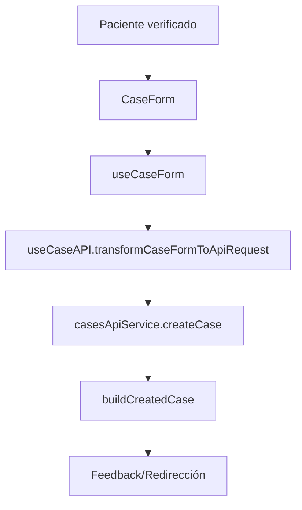

import CodeBlock from '@theme/CodeBlock';

## ¿Qué es el módulo de Casos?

El **módulo de Casos** gestiona el ciclo de vida de los casos patológicos: creación a partir de un paciente verificado, asignación de patólogo, actualización de estado, manejo de muestras y pruebas, y acciones de seguimiento (notas, entrega, cierre).

## Arquitectura

```
modules/cases/
├── components/
│   ├── NewCase.vue              ← Formulario de creación
│   ├── EditCase.vue             ← Formulario de edición
│   └── Shared/
│       ├── CaseForm.vue         ← Formulario base reutilizable
│       ├── PatientSearch.vue    ← Búsqueda/selección de paciente
│       ├── CaseSearch.vue       ← Búsqueda de casos existentes
│       └── PatientInfoCard.vue  ← Resumen del paciente
├── composables/
│   ├── useCaseAPI.ts            ← Flujo de creación de caso (cliente → API)
│   ├── useCaseForm.ts           ← Manejo de estado del formulario
│   ├── usePatientAPI.ts         ← Integración con pacientes
│   ├── useEntityAPI.ts          ← Integración con entidades
│   ├── usePathologistAPI.ts     ← Integración con patólogos
│   ├── useTestAPI.ts            ← Integración con pruebas
│   └── useNotifications.ts      ← Feedback al usuario
├── services/
│   ├── casesApi.service.ts      ← CRUD y acciones sobre casos
│   ├── entitiesApi.service.ts   ← Entidades
│   ├── testsApiService.ts       ← Pruebas
│   └── pathologistApi.service.ts← Patólogos
├── types/                       ← Modelos de dominio (CaseModel, PatientInfo, SampleInfo...)
├── routes/
│   └── casesRoutes.ts           ← Rutas: /cases/new, /cases/:code/edit
└── views/
    ├── NewCaseView.vue
    └── EditCaseView.vue
```

## Flujo de creación de caso



### Composable useCaseAPI.ts

- **transformCaseFormToApiRequest(formData, verifiedPatient)**: Normaliza sexo, tipo de atención, entidad y estructura `samples/tests` al formato esperado por el backend.
- **buildCreatedCase(apiResponse, verifiedPatient, caseData)**: Construye un objeto amigable para UI con datos claves (código, paciente, entidad, prioridad, estado).
- **createCase(caseData, verifiedPatient)**: Orquesta el flujo, maneja estados de carga y errores, y devuelve `{ success, message, case }`.

**Ejemplo de transformación (resumen):**
<CodeBlock language="typescript">{`const apiRequest = {
  patient_info: {
    patient_code: verifiedPatient.patientCode,
    identification_type: verifiedPatient.identification_type,
    identification_number: verifiedPatient.identification_number,
    name: verifiedPatient.name,
    age: Number.parseInt(String(verifiedPatient.age || 0)) || 0,
    gender: normalizeSexo(verifiedPatient.gender),
    entity_info: { id: formData.patientEntity, name: await getEntityNameByCode(formData.patientEntity) },
    care_type: normalizeTipoAtencion(formData.patientCareType)
  },
  requesting_physician: formData.requestingPhysician,
  service: formData.service,
  samples: (formData.samples || []).map(s => ({
    body_region: s.bodyRegion,
    tests: (s.tests || []).map(t => ({ id: t.code, name: t.name || t.code, quantity: t.quantity || 1 }))
  })),
  state: 'En proceso',
  priority: formData.casePriority || 'Normal',
  observations: formData.observations
}`}</CodeBlock>

## Servicios clave (casesApi.service.ts)

El servicio centraliza las operaciones sobre casos y normaliza respuestas.

- **getCaseByCode(code)**, **getCases(params)**, **searchCases(params)**
- **createCase(body)**, **updateCase(code, body)**, **deleteCase(code)**
- **assignPathologist(code, `{ codigo, nombre }`)** / **unassignPathologist(code)**
- **batchCompleteCases(items[])**: Marca múltiples casos como Completado y actualiza muestras restantes y metadatos de entrega.

**Ejemplo de actualización de estado:**
<CodeBlock language="typescript">{`async updateCaseState(caseCode: string, state: string) {
  const updateData = { state }
  return await this.updateCase(caseCode, updateData)
}`}</CodeBlock>

## Modelos de dominio (types/case.ts)

- **CaseModel**: Representación completa del caso (paciente, muestras, estado, prioridad, resultado, asignaciones).
- **PatientInfo / EntityInfo / SampleInfo / TestInfo**: Estructuras base para componer un caso.
- **Enums**: `CasePriority`, `CaseState`, `AttentionType`, `Gender`.

**Fragmento (CaseModel):**
<CodeBlock language="typescript">{`export interface CaseModel {
  case_code: string
  patient_info: PatientInfo
  samples: SampleInfo[]
  state: CaseState
  priority?: CasePriority
  created_at: string
  updated_at: string
  assigned_pathologist?: PathologistInfo
}`}</CodeBlock>

## Componentes y vistas

- **NewCase.vue / CaseForm.vue**: Formulario guiado con selección de entidad, médico solicitante, servicio y muestras con pruebas.
- **EditCase.vue**: Edición/actualización de estado, asignaciones y observaciones.
- **PatientSearch.vue**: Búsqueda y verificación de paciente antes de crear el caso.

### Búsqueda de Paciente (PatientSearch)

 
<div style={{fontSize: '14px', color: '#6b7280', fontStyle: 'italic', marginBottom: '16px'}}>
  Componente de búsqueda y verificación de paciente previo a la creación de un caso.
</div>

**Subcomponentes y composables utilizados**
- `FormSelect`, `FormInput`, `BaseButton` (UI)
- `usePatientAPI` (consulta por tipo/número de identificación)
- `PatientInfoCard` (se renderiza cuando hay resultado)

**Flujo de funcionamiento**
1) Usuario ingresa tipo y número de identificación y presiona "Buscar".
2) `usePatientAPI` llama al backend (GET con query de búsqueda) y normaliza la respuesta.
3) Si encuentra coincidencia, emite el objeto `verifiedPatient` al padre y muestra `PatientInfoCard`.

**Almacenamiento en cliente**
- El paciente verificado se guarda en el estado del `CaseForm` como `verifiedPatient` para usarlo en la creación del caso.

**Contrato con el backend (búsqueda de paciente)**
<CodeBlock language="typescript">{`// Request (query)
GET /patients?search=<dni>

// Response (ejemplo normalizado)
type VerifiedPatientResponse = {
  patientCode: string
  identification_type: string
  identification_number: string
  name: string
  age: number
  gender: 'Masculino' | 'Femenino'
  entity: string
  entityCode?: string
  observations?: string
  location?: { municipality?: string; subregion?: string; address?: string }
}`}</CodeBlock>

### Información del Paciente (PatientInfoCard)

 
<div style={{fontSize: '14px', color: '#6b7280', fontStyle: 'italic', marginBottom: '16px'}}>
  Tarjeta con datos verificados del paciente relevantes para el caso.
</div>

**Subcomponentes y composables utilizados**
- Bloques informativos (UI) e iconos
- Recibe `verifiedPatient` del padre (solo lectura)

**Relación con el guardado**
- `verifiedPatient` es insumo directo para `useCaseAPI.transformCaseFormToApiRequest` completando `patient_info`/`entity_info`.

### Formulario de Caso (CaseForm)

 
<div style={{fontSize: '14px', color: '#6b7280', fontStyle: 'italic', marginBottom: '16px'}}>
  Formulario principal para registrar datos del caso, submuestras y pruebas.
</div>

**Subcomponentes y composables utilizados**
- UI: `FormSelect`, `FormInput`, `FormTextarea`, `BaseButton`
- Listas: `BodyRegionList`, `TestList`
- Composables: `useCaseForm`, `useEntityAPI`, `useTestAPI`
- API: `useCaseAPI` (transformación y envío), `casesApiService`

**Cómo guarda la información**
1) Construye `formData` (entidad, atención, prioridad, servicio, submuestras y pruebas).
2) Llama `useCaseAPI.createCase(formData, verifiedPatient)`.
3) `useCaseAPI` transforma y hace POST con `casesApiService`.
4) Devuelve `{ success, case, message }` para navegación/feedback.

**Contrato con el backend (creación de caso)**
<CodeBlock language="typescript">{`// Endpoint
POST /cases

// Request (simplificado)
type CreateCaseRequest = {
  patient_info: {
    patient_code: string
    identification_type?: string
    identification_number?: string
    name: string
    age: number
    gender: 'Masculino' | 'Femenino'
    entity_info: { id: string; name: string }
    care_type: 'Ambulatorio' | 'Hospitalizado'
    observations?: string
    location?: any
  }
  requesting_physician?: string
  service?: string
  samples: Array<{ body_region: string; tests: Array<{ id: string; name: string; quantity: number }> }>
  state: 'En proceso' | 'Completado' | 'Cancelado' | 'Pendiente'
  priority: 'Normal' | 'Prioritario'
  observations?: string
}

// Response (resumen)
type CreateCaseResponse = {
  case_code: string
  state: string
  patient_info: { patient_code: string; name: string; age: number; gender: string; entity_info: { id: string; name: string }; care_type: string }
  created_at: string
}`}</CodeBlock>

**Transformación aplicada por `useCaseAPI` (extracto)**
<CodeBlock language="typescript">{`const normalizeSexo = (v?: string) => (String(v).toLowerCase().startsWith('f') ? 'Femenino' : 'Masculino')
const normalizeTipoAtencion = (v?: string) => (String(v).toLowerCase().includes('hospital') ? 'Hospitalizado' : 'Ambulatorio')

const apiRequest = {
  patient_info: {
    patient_code: verifiedPatient.patientCode,
    identification_type: verifiedPatient.identification_type,
    identification_number: verifiedPatient.identification_number,
    name: verifiedPatient.name,
    age: Number.parseInt(String(verifiedPatient.age || 0)) || 0,
    gender: normalizeSexo(verifiedPatient.gender),
    entity_info: { id: formData.patientEntity, name: await getEntityNameByCode(formData.patientEntity) },
    care_type: normalizeTipoAtencion(formData.patientCareType)
  },
  samples: (formData.samples || []).map(s => ({
    body_region: s.bodyRegion,
    tests: (s.tests || []).map(t => ({ id: t.code, name: t.name || t.code, quantity: t.quantity || 1 }))
  })),
  state: 'En proceso',
  priority: formData.casePriority || 'Normal',
  observations: formData.observations
}`}</CodeBlock>


### Rutas del módulo

<CodeBlock language="typescript">{`// Front-End/src/modules/cases/routes/casesRoutes.ts
export const casesRoutes = [
  { path: '/cases/new', name: 'cases-new', component: () => import('../views/NewCaseView.vue'), meta: { requiresAuth: true } },
  { path: '/cases/:code/edit', name: 'cases-edit', component: () => import('../views/EditCaseView.vue'), meta: { requiresAuth: true } }
]`}</CodeBlock>
