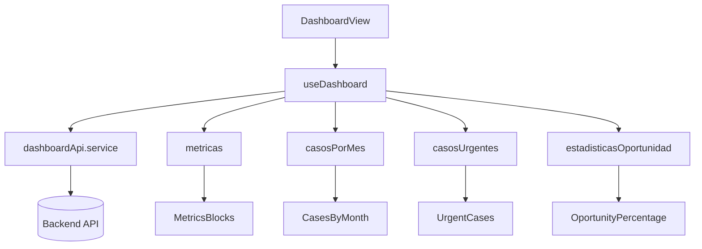

import CodeBlock from '@theme/CodeBlock';

## ¿Qué es el módulo Dashboard?

El **módulo Dashboard** ofrece una vista ejecutiva del estado del sistema: métricas clave, tendencias mensuales de casos, porcentaje de oportunidad (SLA) y monitoreo de casos urgentes. Está optimizado para carga rápida, reactividad y mínima latencia mediante cachés simples y deduplicación de solicitudes.

### ¿Por qué es importante?

- **Visibilidad**: Proporciona KPIs de pacientes y casos en un vistazo
- **Toma de decisiones**: Muestra tendencias y prioridades (casos urgentes)
- **Eficiencia**: Evita solicitudes redundantes y acelera la carga
- **Escalabilidad**: Patrón composables + servicios bien separado

## Arquitectura del módulo

```
modules/dashboard/
├── components/                 ← Componentes Vue del tablero
│   ├── MetricsBlocks.vue       ← KPIs de pacientes y casos
│   ├── CasesByMonth.vue        ← Gráfico/serie de casos por mes
│   ├── UrgentCases.vue         ← Lista de casos urgentes
│   ├── UrgentCaseDetailsModal.vue ← Detalle de caso urgente
│   └── OportunityPercentage.vue← Porcentaje de oportunidad (SLA)
├── composables/
│   ├── useDashboard.ts         ← Lógica reactiva y caché
│   └── index.ts
├── services/
│   ├── dashboardApi.service.ts ← Endpoints y normalización
│   └── index.ts
├── types/
│   ├── dashboard.types.ts      ← Tipos e interfaces
│   └── index.ts
├── routes/
│   └── dashboardRoutes.ts      ← Rutas del módulo
├── views/
│   └── DashboardView.vue       ← Vista principal
└── index.ts
```

## Componentes principales

### MetricsBlocks.vue
Muestra KPIs para pacientes y casos, con variación porcentual respecto al periodo previo. Detecta si el usuario es patólogo para personalizar las métricas.

**Características:**
- Carga paralela de métricas y series mensuales
- Cálculo del delta usando datos disponibles (fallback al valor del backend)
- Reintentos y área de error visible

 
<div style={{fontSize: '14px', color: '#6b7280', fontStyle: 'italic', marginBottom: '16px'}}>
  <strong>Bloques de métricas:</strong> KPIs principales del mes para pacientes y casos, con variación porcentual.
</div>

**Fragmento (cálculo de KPIs):**
<CodeBlock language="typescript">{`const pacientesMesActual = computed(() => Number(metricas.value?.pacientes?.mes_actual ?? 0))
const pacientesCambio = computed(() => {
  const mesAnt = Number(metricas.value?.pacientes?.mes_anterior ?? 0)
  const mesAntAnt = (metricas.value as any)?.pacientes?.mes_anterior_anterior
  if (typeof mesAntAnt === 'number') {
    const denom = mesAntAnt === 0 ? 1 : mesAntAnt
    return Math.round(((mesAnt - mesAntAnt) / denom) * 100)
  }
  return Number(metricas.value?.pacientes?.cambio_porcentual ?? 0)
})`}</CodeBlock>

### CasesByMonth.vue
Serie de 12 meses con total acumulado del año. Usa caché por año y rol para evitar solicitudes repetidas.

**Características:**
- Caché por clave `"año-rol"`
- Totales normalizados y fallback seguro

 
<div style={{fontSize: '14px', color: '#6b7280', fontStyle: 'italic', marginBottom: '16px'}}>
  <strong>Casos por mes:</strong> Serie mensual del año actual con indicador de recarga.
</div>

### UrgentCases.vue / UrgentCaseDetailsModal.vue
Lista de casos urgentes y modal de detalle. Permite filtrar por patólogo o ver vista general.

**Características:**
- Normalización de datos del backend (compatibilidad `cases`/`casos`)
- Límite configurable y mínimo de días en sistema

 
<div style={{fontSize: '14px', color: '#6b7280', fontStyle: 'italic', marginBottom: '16px'}}>
  <strong>Casos urgentes:</strong> Listado con columnas de código, paciente, entidad/patólogo, pruebas y estado/días.
</div>

### OportunityPercentage.vue
Indicador de porcentaje de oportunidad (SLA) y variación. Obtiene datos generales o por patólogo.

**Características:**
- Manejo de cambios de usuario y recargas automáticas
- Valores por defecto seguros si el backend no responde

 
<div style={{fontSize: '14px', color: '#6b7280', fontStyle: 'italic', marginBottom: '16px'}}>
  <strong>Oportunidad:</strong> Indicador de porcentaje con variación y métricas de cumplimiento del periodo.
</div>

## Composable

### useDashboard.ts
Encapsula estado, cargas y cachés para métricas, series mensuales, casos urgentes y oportunidad.

**Estado y cachés:**
<CodeBlock language="typescript">{`const metricas = ref<DashboardMetrics | null>(null)
const casosPorMes = ref<CasosPorMesResponse | null>(null)
const casosUrgentes = ref<CasoUrgente[]>([])
const estadisticasOportunidad = ref<EstadisticasOportunidad | null>(null)

const metricasCache = new Map<string, DashboardMetrics>()
const casosPorMesCache = new Map<string, CasosPorMesResponse>()
const oportunidadCache = new Map<string, EstadisticasOportunidad>()`}</CodeBlock>

**APIs expuestas:**
<CodeBlock language="typescript">{`return {
  error,
  metricas,
  casosPorMes,
  casosUrgentes,
  estadisticasOportunidad,
  loadingMetricas,
  loadingCasosPorMes,
  loadingCasosUrgentes,
  loadingOportunidad,
  totalCasosAño,
  añoActual,
  cargarMetricas,
  cargarCasosPorMes,
  cargarCasosUrgentes,
  cargarEstadisticasOportunidad
}`}</CodeBlock>

## Servicios y Endpoints

### dashboardApi.service.ts
Servicio central del módulo con **deduplicación de requests en vuelo**, **caché** y **normalización**.

**Deduplicación y fetch genérico:**
<CodeBlock language="typescript">{`private async _getJson(url: string, params?: Record<string, unknown>): Promise<any> {
  const key = JSON.stringify({ url, params })
  const existing = this.inflight.get(key)
  if (existing) return existing
  const request = apiClient
    .get<any>(url, { params: { ...(params || {}), _ts: Date.now() } })
    .then(r => (r?.data ?? r))
    .finally(() => this.inflight.delete(key))
  this.inflight.set(key, request)
  return request
}`}</CodeBlock>

**Métricas (general/patólogo):**
<CodeBlock language="typescript">{`async getMetricasDashboard(): Promise<DashboardMetrics> {
  return this._getMetricas(\`${'${'}this.baseUrl.CASES}/statistics/metrics/general\`, { no_cache: true })
}

async getMetricasPatologo(): Promise<DashboardMetrics> {
  const code = await this._getPathologistCode()
  if (!code) return this.getMetricasDashboard()
  return this._getMetricas(\`${'${'}this.baseUrl.CASES}/statistics/metrics/pathologist/\${code}\`, { no_cache: true })
}`}</CodeBlock>

**Casos por mes (general/patólogo):**
<CodeBlock language="typescript">{`async getCasosPorMes(año?: number): Promise<CasosPorMesResponse> {
  const y = año || new Date().getFullYear()
  return this._getCasosPorMes(\`${'${'}this.baseUrl.CASES}/statistics/dashboard/cases-by-month/\${y}\`, { no_cache: true })
}

async getCasosPorMesPatologo(año?: number): Promise<CasosPorMesResponse> {
  const y = año || new Date().getFullYear()
  const code = await this._getPathologistCode()
  if (!code) return this.getCasosPorMes(y)
  return this._getCasosPorMes(\`${'${'}this.baseUrl.CASES}/statistics/dashboard/cases-by-month/pathologist/\${y}\`, { pathologist_code: code, no_cache: true })
}`}</CodeBlock>

**Casos urgentes y oportunidad:**
<CodeBlock language="typescript">{`async getUrgentCasesGeneral(limite = 50): Promise<CasoUrgente[]> {
  return this._getUrgentCases(\`${'${'}this.baseUrl.CASES}/urgent\`, { limit: limite, min_days: 6 })
}

async getUrgentCasesByPathologist(code: string, limite = 50): Promise<CasoUrgente[]> {
  return this._getUrgentCases(\`${'${'}this.baseUrl.CASES}/urgent/pathologist\`, { code, limit: limite, min_days: 6 })
}

async getEstadisticasOportunidad(): Promise<EstadisticasOportunidad> {
  return this._getEstadisticasOportunidad(\`${'${'}this.baseUrl.CASES}/statistics/opportunity/general\`, { no_cache: true })
}`}</CodeBlock>

## Tipos e Interfaces

<CodeBlock language="typescript">{`export interface DashboardMetrics {
  pacientes: { mes_actual: number; mes_anterior: number; cambio_porcentual: number }
  casos: { mes_actual: number; mes_anterior: number; cambio_porcentual: number }
}

export interface CasosPorMesResponse {
  datos: number[]
  total: number
  año: number
}

export interface CasoUrgente {
  codigo: string
  paciente: { nombre: string; cedula: string; entidad?: string }
  pruebas: string[]
  patologo: string
  fecha_creacion: string
  estado: 'En proceso' | 'Por firmar' | 'Por entregar' | 'Completado'
  prioridad: 'Normal' | 'Prioritario'
  dias_en_sistema: number
}

export interface EstadisticasOportunidad {
  porcentaje_oportunidad: number
  cambio_porcentual: number
  tiempo_promedio: number
  casos_dentro_oportunidad: number
  casos_fuera_oportunidad: number
  total_casos_mes_anterior: number
  mes_anterior: { nombre: string; inicio: string; fin: string }
}`}</CodeBlock>

## Rutas

<CodeBlock language="typescript">{`export const dashboardRoutes = [
  {
    path: '/dashboard',
    name: 'dashboard',
    component: () => import('../views/DashboardView.vue'),
    meta: { requiresAuth: true, title: 'Dashboard' }
  }
]`}</CodeBlock>

## Vista principal

### DashboardView.vue
Contenedor de los componentes principales (KPIs, casos por mes, urgentes y porcentaje de oportunidad) y gestión de layout.

**Ejemplo de maquetación (conceptual):**
<CodeBlock language="vue">{`<template>
  <div class="space-y-6">
    <MetricsBlocks />
    <div class="grid grid-cols-1 lg:grid-cols-2 gap-6">
      <CasesByMonth />
      <OportunityPercentage />
    </div>
    <UrgentCases />
  </div>
</template>`}</CodeBlock>

## Flujo de datos



## Buenas prácticas implementadas

- **Caché y deduplicación**: Menos llamadas, mayor rendimiento
- **Normalización**: Manejo de respuestas variables del backend
- **Fallos seguros**: Defaults consistentes si hay errores
- **Reactividad**: Recarga cuando cambian usuario/eventos globales
- **Separación por capas**: Componentes, composables, servicios y tipos