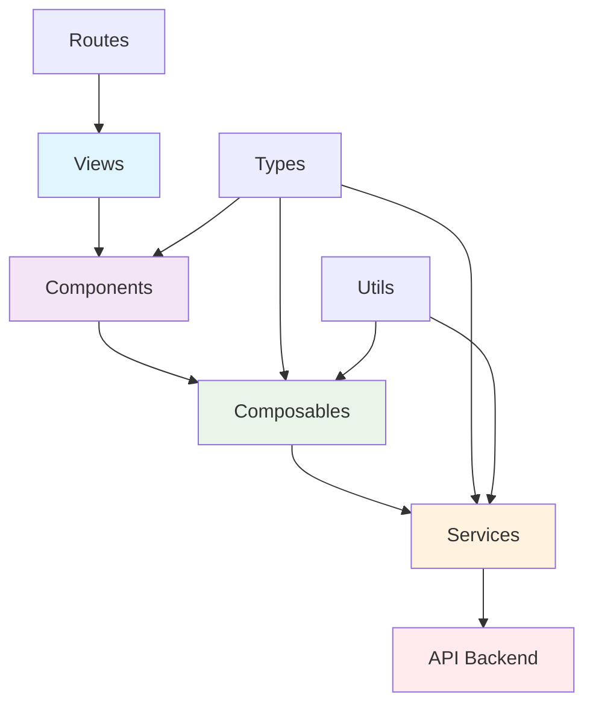

import CodeBlock from '@theme/CodeBlock';

## ¿Qué son los módulos en PathSys?

Los **módulos** en PathSys son unidades funcionales independientes que encapsulan toda la lógica, componentes y servicios relacionados con una funcionalidad específica del sistema. Cada módulo es autónomo y contiene todo lo necesario para funcionar, desde la interfaz de usuario hasta la comunicación con el Back-End.

### ¿Por qué usar módulos?

- **Separación de responsabilidades**: Cada módulo tiene una función específica y bien definida
- **Mantenibilidad**: Cambios en un módulo no afectan a otros
- **Reutilización**: Los módulos pueden ser reutilizados en diferentes contextos
- **Escalabilidad**: Fácil agregar nuevos módulos sin modificar el código existente
- **Colaboración**: Diferentes desarrolladores pueden trabajar en módulos independientes

## Arquitectura de módulos

PathSys implementa una arquitectura modular basada en el patrón **Feature-based Architecture** con una estructura consistente para cada módulo.

### Estructura estándar de un módulo

```
modules/
├── [nombre-modulo]/
│   ├── components/          ← Componentes Vue específicos del módulo
│   │   ├── [ComponentName].vue
│   │   └── index.ts        ← Exportaciones centralizadas
│   ├── composables/         ← Lógica reactiva reutilizable
│   │   ├── use[Feature].ts
│   │   └── index.ts
│   ├── services/            ← Servicios de API y lógica de negocio
│   │   ├── [feature]Api.service.ts
│   │   └── index.ts
│   ├── types/               ← Interfaces y tipos TypeScript
│   │   ├── [feature].types.ts
│   │   └── index.ts
│   ├── routes/              ← Configuración de rutas Vue Router
│   │   └── [feature]Routes.ts
│   ├── views/               ← Vistas principales del módulo
│   │   └── [Feature]View.vue
│   ├── utils/               ← Utilidades específicas (opcional)
│   └── index.ts             ← Exportaciones principales del módulo
```

### Capas de un módulo



## Patrones de diseño implementados

### 1. **Composable Pattern**
Cada módulo utiliza composables para encapsular la lógica reactiva:

<CodeBlock language="typescript">{`// Ejemplo: useDashboard.ts
export function useDashboard() {
  const error = ref<string | null>(null)
  const metricas = ref<DashboardMetrics | null>(null)
  const loadingMetricas = ref(false)

  const cargarMetricas = async (esPatologo: boolean = false) => {
    try {
      loadingMetricas.value = true
      error.value = null
      
      if (esPatologo) {
        metricas.value = await dashboardApiService.getMetricasPatologo()
      } else {
        metricas.value = await dashboardApiService.getMetricasDashboard()
      }
    } catch (err: any) {
      error.value = err.message || 'Error al cargar las métricas'
      throw err
    } finally {
      loadingMetricas.value = false
    }
  }

  return {
    error,
    metricas,
    loadingMetricas,
    cargarMetricas
  }
}`}</CodeBlock>

### 2. **Service Layer Pattern**
Servicios encapsulan la comunicación con APIs:

<CodeBlock language="typescript">{`// Ejemplo: casesApi.service.ts
export class CasesApiService {
  async createCase(caseData: CreateCaseRequest): Promise<Case> {
    try {
      const response = await apiClient.post('/cases', caseData)
      return response.data
    } catch (error) {
      throw new Error('Error al crear el caso')
    }
  }

  async getCases(filters?: CaseFilters): Promise<Case[]> {
    const response = await apiClient.get('/cases', { params: filters })
    return response.data
  }
}

export const casesApiService = new CasesApiService()`}</CodeBlock>

### 3. **Type Safety Pattern**
TypeScript interfaces para garantizar consistencia:

<CodeBlock language="typescript">{`// Ejemplo: case.types.ts
export interface Case {
  id: string
  case_code: string
  patient_id: string
  patient: Patient
  pathologist_id?: string
  pathologist?: Pathologist
  tests: Test[]
  status: CaseStatus
  created_at: string
  updated_at: string
}

export interface CreateCaseRequest {
  patient_id: string
  tests: string[]
  priority: 'normal' | 'urgent' | 'priority'
  notes?: string
}

export type CaseStatus = 'pending' | 'in_progress' | 'completed' | 'delivered'`}</CodeBlock>


## Comunicación entre módulos

### **Eventos globales**
Los módulos se comunican a través de eventos del navegador:

<CodeBlock language="typescript">{`// Emisión de evento desde un módulo
window.dispatchEvent(new CustomEvent('case-created', { 
  detail: { case: caseData, timestamp: new Date().toISOString() } 
}))

// Escucha de evento en otro módulo
window.addEventListener('case-created', (event) => {
  const { case: newCase } = event.detail
  // Actualizar estado o UI
})`}</CodeBlock>

### **Stores compartidos**
Algunos módulos comparten estado a través de Pinia stores:

<CodeBlock language="typescript">{`// stores/cases.store.ts
export const useCasesStore = defineStore('cases', () => {
  const cases = ref<Case[]>([])
  const notifyCaseCreated = () => {
    // Lógica de notificación
  }
  
  return { cases, notifyCaseCreated }
})`}</CodeBlock>

### **Servicios compartidos**
Servicios comunes utilizados por múltiples módulos:

<CodeBlock language="typescript">{`// shared/services/
export { apiClient } from './apiClient'
export { entitiesApiService } from './entities.service'
export { pathologistsApiService } from './pathologists.service'`}</CodeBlock>

## Beneficios de la arquitectura modular

### **1. Mantenibilidad**
- **Código organizado**: Cada módulo tiene su responsabilidad específica
- **Cambios localizados**: Modificaciones no afectan otros módulos
- **Debugging simplificado**: Errores limitados al módulo específico

### **2. Escalabilidad**
- **Nuevos módulos**: Fácil agregar funcionalidades sin modificar código existente
- **Equipos distribuidos**: Diferentes desarrolladores pueden trabajar en módulos independientes
- **Testing aislado**: Cada módulo puede ser probado independientemente

### **3. Reutilización**
- **Composables**: Lógica reutilizable entre módulos
- **Servicios**: APIs compartidas entre módulos
- **Componentes**: UI components reutilizables

### **4. Performance**
- **Lazy loading**: Módulos se cargan solo cuando se necesitan
- **Code splitting**: Cada módulo genera su propio chunk
- **Tree shaking**: Eliminación de código no utilizado

Esta arquitectura modular asegura que PathSys sea un sistema robusto, mantenible y escalable, donde cada funcionalidad está bien encapsulada y puede evolucionar independientemente.