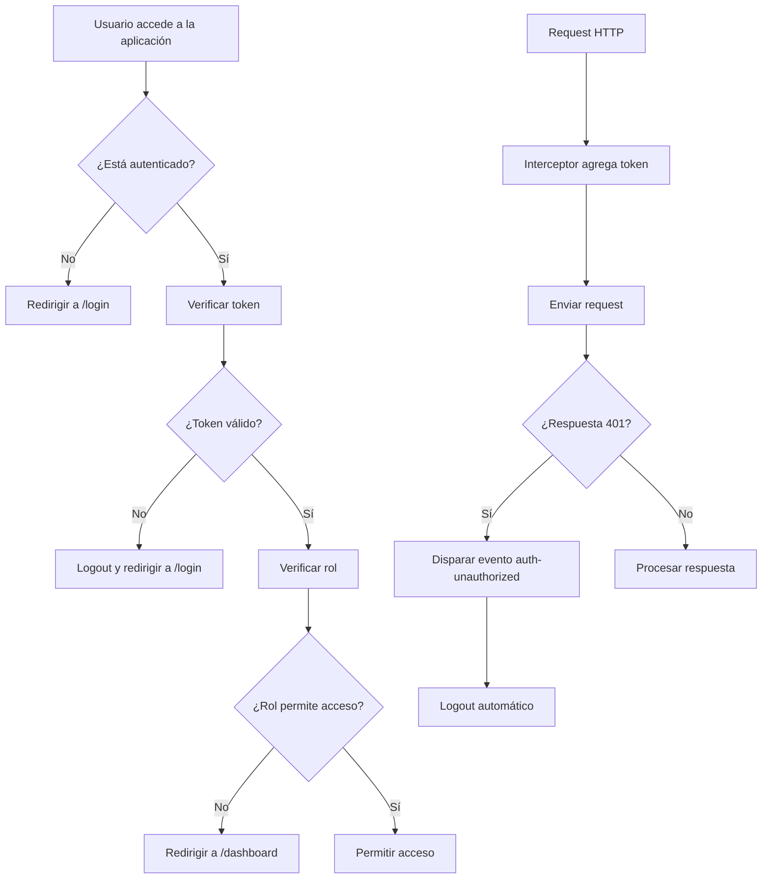

import CodeBlock from '@theme/CodeBlock';

## ¿Qué es la seguridad del cliente?

La **seguridad del cliente** en PathSys abarca todas las medidas implementadas en el Front-End para proteger la aplicación, los datos del usuario y la comunicación con el servidor. Incluye autenticación, autorización, protección de rutas, manejo seguro de tokens y prevención de vulnerabilidades comunes.

### ¿Por qué es importante?

- **Protección de datos**: Asegura que la información sensible no sea accesible por usuarios no autorizados
- **Integridad de sesiones**: Mantiene la validez y seguridad de las sesiones de usuario
- **Control de acceso**: Implementa un sistema robusto de roles y permisos
- **Prevención de ataques**: Mitiga vulnerabilidades como XSS, CSRF y acceso no autorizado

## Flujo de seguridad completo

El siguiente diagrama muestra el flujo completo de seguridad implementado en PathSys:



Este flujo asegura que cada interacción del usuario sea validada en múltiples capas de seguridad.

## Arquitectura de seguridad

PathSys implementa una arquitectura de seguridad multicapa que incluye:

```
┌─────────────────────────────────────────────────────────────┐
│                    CAPA DE PRESENTACIÓN                     │
├─────────────────────────────────────────────────────────────┤
│  • Guards de rutas (roleGuard)                              │
│  • Interceptores HTTP (axios)                               │
│  • Validación de formularios                                │
│  • Sanitización de datos                                    │
├─────────────────────────────────────────────────────────────┤
│                    CAPA DE ESTADO                           │
├─────────────────────────────────────────────────────────────┤
│  • Store de autenticación (Pinia)                           │
│  • Persistencia segura (localStorage/sessionStorage)        │
│  • Verificación de tokens                                   │
│  • Manejo de sesiones                                       │
├─────────────────────────────────────────────────────────────┤
│                    CAPA DE COMUNICACIÓN                     │
├─────────────────────────────────────────────────────────────┤
│  • Cliente HTTP configurado (axios)                         │
│  • Headers de seguridad                                     │
│  • Manejo de errores HTTP                                   │
│  • Timeouts y reintentos                                    │
└─────────────────────────────────────────────────────────────┘
```

## Sistema de autenticación

### Interfaz de login

PathSys implementa una interfaz de login segura y profesional que forma la primera línea de defensa del sistema:


<div style={{fontSize: '14px', color: '#6b7280', fontStyle: 'italic', marginBottom: '16px'}}>
  <strong>Pantalla de login de PathSys:</strong> Interfaz de autenticación con validación en tiempo real, campos de email y contraseña, opción "Mantenerme conectado" y diseño institucional con logos de HAMA, LIME y Universidad de Antioquia.
</div>

**Características de seguridad de la interfaz:**
- **Validación en tiempo real**: Los campos se validan mientras el usuario escribe
- **Indicadores visuales**: Checkmark verde para email válido, iconos descriptivos
- **Opción de persistencia**: "Mantenerme conectado" para sesiones persistentes vs temporales
- **Diseño profesional**: Logos institucionales que generan confianza
- **Campos protegidos**: Contraseña con máscara y toggle de visibilidad

### Gestión de tokens JWT

PathSys utiliza **JSON Web Tokens (JWT)** para la autenticación, implementando un sistema robusto de manejo de tokens.

#### Estructura del token

```typescript
interface TokenPayload {
  user_id: string
  email: string
  role: string
  exp: number  // Timestamp de expiración
  iat: number  // Timestamp de emisión
}
```

#### Verificación de tokens

El sistema verifica automáticamente la validez de los tokens:

<CodeBlock language="typescript">{`// Verificación de token en AuthApiService
async verifyToken(token: string): Promise<{ valid: boolean; user?: User }> {
  try {
    const response = await fetch(\`\${this.baseUrl}/auth/me\`, {
      method: 'GET',
      headers: { ...getAuthHeaders(token) },
    })

    if (!response.ok) {
      // Si es 401 o 403, el token es definitivamente inválido
      if (response.status === 401 || response.status === 403) {
        return { valid: false }
      }
      throw new Error(\`Error del servidor: \${response.status}\`)
    }

    const data = await response.json()
    return { valid: true, user: data }
  } catch (error) {
    console.error('Error verificando token:', error)
    throw error
  }
}`}</CodeBlock>

### Persistencia segura de sesiones

El sistema implementa dos tipos de persistencia según la preferencia del usuario:

#### Opciones de almacenamiento

- **localStorage**: Para sesiones persistentes (recordar usuario)
- **sessionStorage**: Para sesiones temporales (solo durante la sesión del navegador)

<CodeBlock language="typescript">{`// Configuración de persistencia en AuthStore
const login = async (credentials: LoginRequest, rememberMe: boolean = false) => {
  try {
    const response = await authApiService.login(credentials)
    
    // Guardar token y usuario
    token.value = response.access_token
    user.value = response.user

    // Persistir sesión basada en rememberMe
    const storage = rememberMe ? window.localStorage : window.sessionStorage
    storage.setItem('auth_token', response.access_token)
    storage.setItem('auth_user', JSON.stringify(response.user))
    
    // Guardar timestamp de expiración
    try {
      const parts = response.access_token?.split('.') || []
      if (parts.length === 3) {
        const payloadJson = JSON.parse(atob(parts[1]))
        const expSec = Number(payloadJson?.exp)
        if (!Number.isNaN(expSec) && expSec > 0) {
          const expiresAt = expSec * 1000
          storage.setItem('auth_expires_at', String(expiresAt))
        }
      }
    } catch (_e) {
      // Fallback a expires_in
      if (response.expires_in && response.expires_in > 0) {
        const expiresAt = Date.now() + response.expires_in * 1000
        storage.setItem('auth_expires_at', String(expiresAt))
      }
    }

    return true
  } catch (err) {
    error.value = err.message || 'Error signing in'
    return false
  }
}`}</CodeBlock>

## Sistema de autorización y roles

### Definición de roles

PathSys implementa un sistema granular de roles con permisos específicos:

<CodeBlock language="typescript">{`// Roles disponibles en el sistema
export type RoleEnum = 
  | 'administrator'  // Administrador del sistema
  | 'pathologist'    // Patólogo
  | 'resident'       // Residente
  | 'receptionist'   // Recepcionista
  | 'auxiliar'       // Auxiliar
  | 'billing'        // Facturación
  | 'patient'        // Paciente

// Interface de usuario con información de rol
interface User {
  id: string
  email: string
  role: string
  is_active: boolean
  name?: string
  administrator_code?: string
  pathologist_code?: string
  resident_code?: string
  auxiliary_code?: string
  billing_code?: string
}`}</CodeBlock>

### Guards de rutas (roleGuard)

El sistema implementa un guard de rutas que controla el acceso basado en roles:

<CodeBlock language="typescript">{`// Guard de autorización por roles
export function roleGuard(
  to: RouteLocationNormalized,
  from: RouteLocationNormalized,
  next: NavigationGuardNext
): void {
  const authStore = useAuthStore()
  
  if (!authStore.isAuthenticated) {
    next()
    return
  }
  
  const userRole = authStore.userRole
  
  // Definir rutas permitidas para cada rol
  const roleRoutes: Record<string, string[]> = {
    pathologist: [
      '/dashboard', '/cases', '/results', 
      '/complementary-techniques', '/patients', '/profile', '/support'
    ],
    auxiliar: [
      '/dashboard', '/cases', '/results', '/complementary-techniques',
      '/patients', '/profile', '/reports', '/statistics', '/support'
    ],
    resident: [
      '/dashboard', '/cases', '/results', '/complementary-techniques',
      '/patients', '/profile', '/reports', '/support'
    ],
    billing: [
      '/dashboard', '/cases/list', '/statistics', '/profile', '/support'
    ],
    administrator: [
      '/dashboard', '/cases', '/results', '/complementary-techniques',
      '/patients', '/profile', '/reports', '/statistics', '/support',
      '/pathologist-assignment'
    ],
    patient: [
      '/dashboard', '/cases/list', '/profile', '/support'
    ]
  }

  const allowedRoutes = roleRoutes[userRole] || []
  const isRouteAllowed = allowedRoutes.some((route: string) => 
    to.path.startsWith(route)
  )

  if (!isRouteAllowed) {
    next({ path: '/dashboard' })
    return
  }
  
  next()
}`}</CodeBlock>

### Verificación de permisos en componentes

Los componentes pueden verificar permisos usando el store de autenticación:

<CodeBlock language="vue">{`<template>
  <div>
    <!-- Botón solo visible para administradores -->
    <button 
      v-if="authStore.isAdministrator" 
      @click="adminAction"
    >
      Acción de Administrador
    </button>
    
    <!-- Botón solo visible para patólogos -->
    <button 
      v-if="authStore.isPathologist" 
      @click="pathologistAction"
    >
      Revisar Caso
    </button>
  </div>
</template>

<script setup lang="ts">
import { useAuthStore } from '@/stores/auth.store'

const authStore = useAuthStore()

// Verificar múltiples roles
const canEditCases = computed(() => 
  authStore.isPathologist || authStore.isAdministrator
)

// Verificar rol específico
const canViewReports = computed(() => 
  ['administrator', 'auxiliar', 'resident'].includes(authStore.userRole || '')
)
</script>`}</CodeBlock>

## Protección de rutas

### Configuración del router

El router de Vue implementa múltiples capas de protección:

<CodeBlock language="typescript">{`// Configuración del router con guards
router.beforeEach(async (to, _from, next) => {
  const authStore = useAuthStore()
  
  // Rutas públicas que no requieren autenticación
  const publicRoutes = ['/login']
  const isPublicRoute = publicRoutes.includes(to.path)
  
  // Inicializar autenticación si no está autenticado
  if (!authStore.isAuthenticated) {
    await authStore.initializeAuth()
  }
  
  // Verificar expiración del token
  if (authStore.isAuthenticated) {
    const savedExpiresAt = localStorage.getItem('auth_expires_at') || 
                          sessionStorage.getItem('auth_expires_at')
    if (savedExpiresAt && Date.now() > Number(savedExpiresAt)) {
      await authStore.logout()
      next('/login')
      return
    }
  }

  // Redirigir usuarios autenticados desde rutas públicas
  if (isPublicRoute && authStore.isAuthenticated) {
    next('/dashboard')
    return
  }
  
  // Redirigir usuarios no autenticados a login
  if (!isPublicRoute && !authStore.isAuthenticated) {
    next('/login')
    return
  }
  
  // Aplicar restricciones de rol
  if (authStore.isAuthenticated) {
    roleGuard(to, _from, next)
    return
  }
  
  next()
})`}</CodeBlock>

## Interceptores HTTP y seguridad

### Configuración de Axios

El cliente HTTP está configurado con interceptores para manejar automáticamente la autenticación y errores:

<CodeBlock language="typescript">{`// Cliente HTTP con interceptores de seguridad
class ApiClient {
  constructor() {
    this.instance = axios.create({
      baseURL: API_CONFIG.BASE_URL + API_CONFIG.VERSION,
      timeout: API_CONFIG.TIMEOUT,
      headers: API_CONFIG.DEFAULT_HEADERS,
      maxRedirects: 5,
      validateStatus: function (status: number) {
        return status >= 200 && status < 400
      }
    })

    this.setupInterceptors()
  }

  private setupInterceptors(): void {
    // Request interceptor - agregar token automáticamente
    this.instance.interceptors.request.use(
      (config: any) => {
        // Leer token de localStorage o sessionStorage
        const token = localStorage.getItem('auth_token') || 
                     sessionStorage.getItem('auth_token')
        
        if (token) {
          config.headers.Authorization = \`Bearer \${token}\`
        }
        
        return config
      },
      (error: any) => Promise.reject(error)
    )

    // Response interceptor - manejo de errores de autenticación
    this.instance.interceptors.response.use(
      (response: any) => response,
      (error: any) => {
        if (error.response) {
          const { status } = error.response
          
          switch (status) {
            case 401:
              console.warn('Token expirado detectado en interceptor')
              // Disparar evento global para manejo de logout
              window.dispatchEvent(new CustomEvent('auth-unauthorized'))
              break
              
            case 403:
              console.warn('Acceso denegado')
              break
              
            case 422:
              // Error de validación - mantener error para manejo específico
              break
          }
        }
        
        return Promise.reject(error)
      }
    )
  }
}`}</CodeBlock>

### Manejo global de errores de autenticación

El sistema implementa un manejo global de errores 401:

<CodeBlock language="typescript">{`// Composable para manejo de persistencia de autenticación
export function useAuthPersistence() {
  const authStore = useAuthStore()
  const router = useRouter()

  // Listener para eventos globales de 401
  const onUnauthorized = async () => {
    console.warn('Evento global auth-unauthorized recibido: cerrando sesión')
    await authStore.logout()
    if (router.currentRoute.value.path !== '/login') {
      router.push('/login')
    }
  }

  // Verificación periódica de tokens (cada 60 minutos)
  const startTokenRefreshTimer = () => {
    const interval = setInterval(async () => {
      if (authStore.isAuthenticated && authStore.token) {
        try {
          const isValid = await authStore.verifyToken()
          if (!isValid && router.currentRoute.value.path !== '/login') {
            console.warn('Token expirado, redirigiendo a login')
            clearInterval(interval)
            await authStore.logout()
            router.push('/login')
          }
        } catch (error) {
          console.error('Error en verificación periódica de token:', error)
        }
      }
    }, 60 * 60 * 1000) // 60 minutos

    return interval
  }

  onMounted(() => {
    // Escuchar eventos de 401 no autorizado
    window.addEventListener('auth-unauthorized', onUnauthorized)
    
    // Iniciar verificación periódica después de 30 segundos
    setTimeout(() => {
      startTokenRefreshTimer()
    }, 30000)
  })

  onUnmounted(() => {
    window.removeEventListener('auth-unauthorized', onUnauthorized)
  })
}`}</CodeBlock>

## Configuración de seguridad

### Headers de seguridad

La aplicación configura headers de seguridad apropiados:

<CodeBlock language="typescript">{`// Configuración de headers de seguridad
export const API_CONFIG = {
  BASE_URL: import.meta.env.VITE_API_BASE_URL || 'http://localhost:8000',
  VERSION: '/api/v1',
  TIMEOUT: 30000,
  
  DEFAULT_HEADERS: {
    'Content-Type': 'application/json',
    'Accept': 'application/json',
  },
  
  RETRY: {
    MAX_ATTEMPTS: 3,
    DELAY: 1000,
  },
  
  CACHE: {
    ENABLED: true,
    TTL: 5 * 60 * 1000, // 5 minutos
  }
}

// Función para obtener headers con autenticación
export function getAuthHeaders(token?: string): Record<string, string> {
  const headers: Record<string, string> = { ...API_CONFIG.DEFAULT_HEADERS }
  
  if (token) {
    headers['Authorization'] = \`Bearer \${token}\`
  }
  
  return headers
}`}</CodeBlock>

### Variables de entorno

Las configuraciones sensibles se manejan mediante variables de entorno:

```bash
# .env
VITE_API_BASE_URL=http://localhost:8000
VITE_APP_ENV=development
```


## Consideraciones de desarrollo

### Para desarrolladores

1. **Siempre verificar permisos** antes de mostrar componentes sensibles
2. **Usar el store de autenticación** para verificar roles y estado
3. **Implementar guards** en rutas que requieren autenticación
4. **Manejar errores 401/403** apropiadamente en componentes
5. **No almacenar datos sensibles** en el estado del componente

Esta implementación de seguridad asegura que PathSys mantenga un alto estándar de protección de datos y control de acceso, proporcionando una base sólida para el manejo de información médica sensible.